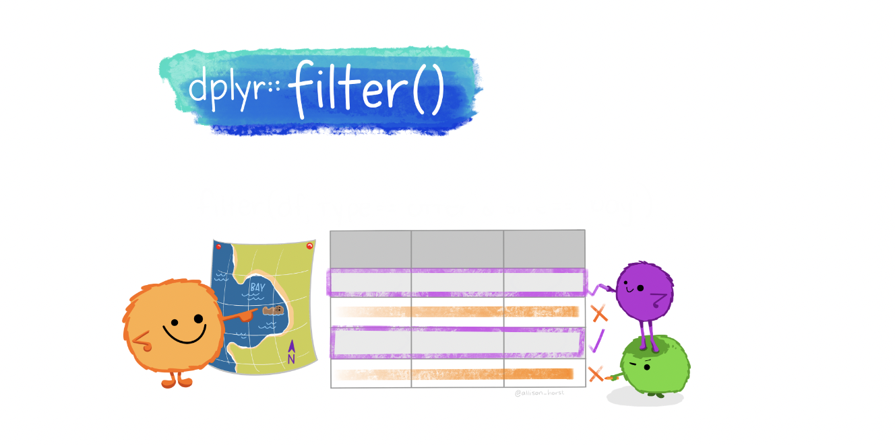

```{r setup, include=FALSE}
library(devtools)
library(learnr)
library(submitr)
library(gradethis)
library(tidyverse)
library(knitr)
library(ggmosaic)
library(praise)
library(utils)
library(dplyr)
library(ggplot2)


learnr::tutorial_options(exercise.eval = TRUE, 
                         exercise.reveal_solution = FALSE, 
                         exercise.timelimit = 30,
                         exercise.checker = gradethis::grade_learnr,
)


gradethis::gradethis_setup(
  pass.praise = TRUE,
  fail.encourage = TRUE,
  fail.hint = TRUE
)
knitr::opts_chunk$set(error = TRUE, eval = T, echo = T)
titanicdata<-read.csv("https://raw.githubusercontent.com/bitarellolab/Teaching/main/B215/data/titanic.csv", stringsAsFactors = TRUE)
bat.tongues<-read.csv("https://raw.githubusercontent.com/bitarellolab/Teaching/main/B215/data/BatTongues.csv", stringsAsFactors = TRUE)
guppyFatherSonData <-read.csv("https://raw.githubusercontent.com/bitarellolab/Teaching/main/B215/data/chap02e3bGuppyFatherSonAttractiveness.csv")
```

```{css echo=FALSE}
 @media print {
  .topicsContainer,
  .topicActions,
  .exerciseActions .skip {
    display: none;
  }
  .topics .tutorialTitle,
  .topics .section.level2,
  .topics .section.level3:not(.hide) {
    display: block;
  }
  .topics {
    width: 100%;
  }
  .tutorial-exercise, .tutorial-question {
    page-break-inside: avoid;
  }
  .section.level3.done h3 {
    padding-left: 0;
    background-image: none;
  }
  .topics .showSkip .exerciseActions::before {
    content: "Topic not yet completed...";
    font-style: italic;
  }
}
/* paste CSS above here */
```

## Tasks

Tasks: 

-   Work through this document
-   Work through the Rstudio R markdown tutorial
-   Complete datacamp activities about R markdown, reading in data into R, the tidyverse
-   Submit the PDF you save from this document

## Contents

1.  The bare bones of R markdown - a way to make your work reproducible and pretty!

2. Getting data into R

3. Summary statistics and NAs

4. Soft introduction to the `tidyverse` packages

5. Routine data wrangling tasks with `dplyr` core functions: `filter`, `select`, `mutate`, `arrange`, `transmute`, `summarise`

6. Pipe `%>%` these operations together.

7. The `ggplot2` package for plots

## R markdown

For this portion we are going to use Rstudio's R markdown tutorial. They created R markdown, after all.

Remember: all your Lab Assignments will need to be written in R markdown, so take the time to learn this.

* Go to [https://rmarkdown.rstudio.com/lesson-1.html](https://rmarkdown.rstudio.com/lesson-1.html) and complete the tutorial
* Make sure you use your Posit cloud workspace to try out things.
* When you're done, restart this tutorial and continue from here.

For future reference, there is no need to memorize anything, check out [this handy cheat sheet](https://github.com/rstudio/cheatsheets/raw/main/rmarkdown-2.0.pdf) and [this reference guide](https://www.rstudio.com/wp-content/uploads/2015/03/rmarkdown-reference.pdf) anytime. 

## Getting data into R

Main ways:


* load an R "object" from a package (e.g. the `datasets` package)
* load an R "object" from a file (e.g. files that end in `.Rds` or `.rds`)
* reading in data from a flat text file with delimiters like comma (`.csv` files) or tab
* reading in data from other data file types 
* in Rstudio, you can also use the "Import Dataset" option from the file menu. This is not ideal in terms of reproducibility but can be helpful for beginners.

You can import many types of data in R. If you want to see which file types are possible to read in from base R, type "read" in the console and then hit tab. That will show you all the various types of read functions for different file types inherent to base R. 


E.g., reading in data from a `.csv` text file:


A `.csv` file is a very common format for tables of data. For example, you can export an Excel or google sheets spreadsheet into a `.csv` file very easily.

Here we will use a very simple function from base R called `read.csv`.


```{r setupnum, echo=F, eval=T}
titanicdata<-read.csv("https://raw.githubusercontent.com/bitarellolab/Teaching/main/B215/data/titanic.csv", stringsAsFactors = TRUE)
bat.tongues<-read.csv("https://raw.githubusercontent.com/bitarellolab/Teaching/main/B215/data/BatTongues.csv", stringsAsFactors = TRUE)
guppyFatherSonData <-read.csv("https://raw.githubusercontent.com/bitarellolab/Teaching/main/B215/data/chap02e3bGuppyFatherSonAttractiveness.csv")
```


```{r read-in, exercise=TRUE}
titanicdata<-read.csv("https://raw.githubusercontent.com/bitarellolab/Teaching/main/B215/data/titanic.csv", stringsAsFactors = TRUE)
```

### Quick summary and checking dimensions

Now that you've seen how you can read in files from a spreadsheet, let's have a first glance at the data.

* use head on the object `titanicdata`
* use tail on the object `titanicdata`


```{r ex1, exercise = TRUE, eval=T, exercise.setup="setupnum"}
        # use the head command
        # use the tail command

```


```{r ex1-solution}
head(titanicdata)
tail(titanicdata)

```

```{r ex1-check}
grade_this_code()
```

There are at least three other functions that are great for having a first glance at your data.

`dim`: we've seen this one. It gives the number of rows and columns.

`str`: will give you the data type for each column.

`summary`: will give you a sense the center and width of numeric data, levels for factors, and counts for T/F. Not very informative for characters.


First try the `dim` function.

```{r ex2, exercise = TRUE, eval=T, exercise.setup="setupnum"}
 


```


```{r ex2-solution}
dim(titanicdata)


```

```{r ex2-check}
grade_this_code()
```

Now try the `str` function.

```{r ex3, exercise = TRUE, eval=T, exercise.setup="setupnum"}
      


```


```{r ex3-solution}
str(titanicdata)


```

```{r ex3-check}
grade_this_code()
```


Finally, try the `summary` function.


```{r ex4, exercise = TRUE, eval=T, exercise.setup="setupnum"}
        


```


```{r ex4-solution}
summary(titanicdata)


```

```{r ex4-check}
grade_this_code()
```


## Summary statistics and missing data!

Now look at age by selecting the column `age` in the `titanicdata` object and printing out that column (use `$` to index the column). Use `print` to print it.

```{r x5, exercise = TRUE, exercise.setup = "setupnum"}
                    
```


```{r x5-solution}
print(titanicdata$age)

```

```{r x5-check}
grade_this_code()
```

If you look through the results, you will see that most values in this list are numbers, but some are NAs. These NAs are the people for which we do not have age information.

By the way, the `titanic.csv` file simply has nothing in the places where there is missing data. See for yourself: [link](https://docs.google.com/spreadsheets/d/111Ez-a6GCeUYcprUzKwcTWE3Adux30UHKRxXDL83Luw/edit?usp=sharing).

When R loaded it, it replaced the empty spots with NA automatically!

We have already seen in lab 2 how to calculate the mean of a vector of data using `mean()`. Unfortunately, if there are missing data we need to tell R how to deal with it. A (somewhat annoying) quirk of R is that if we try to take the mean of a list of numbers that include missing data, we get an NA for the result! But you already know how to get around this.

Calculate the mean of the `age` column below:


```{r x6, exercise = TRUE, exercise.setup = "setupnum"}
                    
```


```{r x6-solution}
mean(titanicdata$age, na.rm=TRUE)

```

```{r x6-check}
grade_this_code()
```

Many other functions have this `na.rm = T` option, but for those that don't, you will have to do some data cleaning, which we will learn how to do shortly.

So, should you always set `na.rm=T` just in case? Sure. But you will still want to know whether there are any NAs in your data to begin with, because you should know that instead of simply ignoring it.

One way to do that is to use the function `is.na`. Use it on the `age` column of the `titanicdata` dataset:

```{r x7, exercise = TRUE, exercise.setup = "setupnum"}
                    
```


```{r x7-solution}
is.na(titanicdata$age)

```


```{r x7-check}
grade_this_code()
```

This will return a logical vector of same length as `titanicdata$age` which tells you which rows have NA (TRUE) and which don't (FALSE).

This turned out to be a very long vector! How can we simplify this output? 

We could use the function `table` on the output of the command above. THis will give us two columns, one containing the number of results that are `TRUE` and anoter for `FALSE`.

Try that here:

```{r x8, exercise = TRUE, exercise.setup = "setupnum"}
                    
```


```{r x8-solution}
table(is.na(titanicdata$age))

```


```{r x8-check}
grade_this_code()
```

Try calculating the standard deviation and variance of the age data using the R functions `sd` and `var`. Don't forget to deal with the NAs.

```{r x9, exercise = TRUE, exercise.setup = "setupnum"}
                    
```


```{r x9-solution}
sd(titanicdata$age, na.rm = TRUE)
var(titanicdata$age, na.rm = TRUE)
```

```{r x9-check}
grade_this_code()
```

If you notice, variance is just SD squared. Or. SD is just variance square rooted.

Other metrics of variation include the coefficient of variation. Surprisingly, there is no standard function in R to calculate the coefficient of variation. You can do this yourself, though, directly from the definition: $CV=100\times \frac{S_{X}}{\bar{X}}$

```{r manual-cv, exercise=TRUE}
100 * sd(titanicdata$age, na.rm = TRUE) / mean(titanicdata$age, na.rm = TRUE) 

```

Other metrics include range and interquartile range which are the difference between the max and the min points in the data and the third quartile and first quartile in the data respectively. You can call these functions as `range()` and `IQR()` in the exact same format as `mean()` and `sd()`.

Try running them below.

```{r x-iqr, exercise = TRUE, exercise.setup = "setupnum"}
                    
```


```{r x-iqr-solution}
IQR(titanicdata$age, na.rm = TRUE)
range(titanicdata$age, na.rm = TRUE)
```

```{r x-iqr-check}
grade_this_code()
```


### Actually removing missing data from your R object

Lets say you are trying to do a statistical test which lacks na. rm capabilities? Well, it's pretty simple. You can use `na.omit`.

```{r ex-naomit-setup, exercise = TRUE}
titanicdata2<-na.omit(titanicdata)
```

We can confirm that the missing rows have been deleted by comparing the number of rows in titanicdata2 with titanic data by using `nrow` on both objects:


```{r ex-naomit, exercise = TRUE, exercise.setup="ex-naomit-setup"}

```


```{r ex-naomit-solution}
nrow(titanicdata)-nrow(titanicdata2)
```


```{r ex-naomit-check}
grade_this_code()
```


But did this function actually remove all the rows with missing data or did it mess up? 

Well, three functions are useful for us to decide. 

`length` returns the number of entries

`which` 

`is.na`, which returns a logical statement stating whether any entry in the input is NA.

Try testing whether there are any NAs in `titanicdata`  (entire data.frame, not any single column) using `is.na` (which, because we know there are, should return TRUE). Use the command `table` around this to simplify the output.

```{r x10, exercise = TRUE, exercise.setup = "setupnum"}
                    
```


```{r x10-solution}
table(is.na(titanicdata))

```

```{r x10-check}
grade_this_code()
```

Now, since we know the number of NAs in the age column,we can check whether these numbers are the same. (they are!)


## A soft intro to the Tidyverse packages

*Note: most of the material in this section comes from Y. Brandvain's Applied Biostatistics online book. *

A great part about R is that many people have written packages to help with specific tasks.

The tidyverse refers to both a set of packages, and a way to do things in R. The tidyverse packages we use the most in this course are:

`ggplot2`: For making plots.

`dplyr`: For summarizing and handling data.

`tidyr`: For converting data from wide to long format (and vice versa).

`readr`: For reading in data.

We will use the `tibble`, `stringr`, `forcats`, and `purrr` packages less often if at all. But `ggplot2` and `dplyr` are crucial in this day and age.

{width=70%}


**Why?**

One major reason for this is that the focus on a shared and coherent philosophy, grammar and data structure makes the tidyverse **easier to teach and learn than base R**. However, there are still challenges to learning and teaching the tidyverse, the two major challenges are:

1. It takes time to learn and appreciate the shared philosophy and data structure.

2. Many people first learned R using base R, so it can be frustrating to start to learn again.

Overcoming challenge 1 takes time but is helped by reflecting on why and how code works when it works, and fails when it fails (rather than copying and pasting code that works), and continually asking questions.

### Tidy data

Tidyverse tools can be useful and general because they rely on a certain and predictable data structure known as “tidy data.”

Characteristics of tidy data:

* Each variable must have its own column.
* Each observation must have its own row.
* Each value must have its own cell.


{width=80%}


{width=70%}


A major benefit of the tidy data structure is that when data structure is reliable, we can deal with diverse data sets in a consistent way.


{width=70%}


### Structure of a good data file

Data files appear in many formats, and different formats are sometimes preferable for different tasks. But there is one way to structure data—called “long” format—that is extremely useful for most things that you will want to do in statistics and R.

Long format is actually very simple. Every row in the data set is a unique individual (see "tidy data", above). Every column is a variable being measured on those individuals.

For example, here are some data about the tongue and palate lengths of several species of bats. There are three variables in that data set, the species name, tongue length, and palate length. Here each “individual” is a species. Here is that data in long format—each row is an individual. There are three columns, one for each variable:


Use this link to read in a csv file into `bat_tongue` using the `read.csv` function. Next, call `str` and `head` on the object to have a first look at it.

```{r bat1, echo=T, exercise=TRUE}
link_to_file<-"https://raw.githubusercontent.com/bitarellolab/Teaching/main/B215/data/BatTongues.csv"
        #use read.csv
        #use str
        #use head


```


```{r bat1-solution}
link_to_file<-"https://raw.githubusercontent.com/bitarellolab/Teaching/main/B215/data/BatTongues.csv"
bat_tongue<-read.csv(link_to_file)
str(bat_tongue)
head(bat_tongue)
```

```{r bat1-check}
grade_code()
```


When handed data to analyze, it is good practice to ask yourself if it is tidy. If it isn't, you can modify it and save a new version after you've processed it. How?

There are many ways but here is one. Let's say you wanted to change something about `bat.tongues` and then save that as a new file.

```{r, eval=F}
head(bat.tongues) #this you know
# change colum name "species" to "Species"
colnames(bat.tongues)[1]<-"Species" 
head(bat.tongues)

write.csv(x = bat.tongues, file = "my_bat_tongues.csv", quote = F, sep = ",") #write a file with comma separated columns and do not quote characters/strings
```

**Warning**: you can't actually write files while using this interactive activity, but within R, later, you can. When you do this, look at the `files` pane on the right and you should now see your file there. Voilà! You changed a dataset to your liking without changing the raw data. 

**NEVER CHANGE RAW DATA!!!!!NEVER CHANGE RAW DATA!!!!!NEVER CHANGE RAW DATA!!!!!NEVER CHANGE RAW DATA!!!!!**


### Creating a data file

When you have new data that you want to get into the computer in a format that R can read, it is often easiest to do this outside of R. A spreadsheet program like Excel (or a freely available program like OpenOffice Calc, Google sheets, etc) is a straightforward way to create a .csv file that R can read.

In your spreadsheet program, open a new window with New Workbook under the File menu. In the first row of your new spreadsheet, write your variable names, one for each column. (Be sure to give them good names that will work in R. Mainly, don’t have any spaces in a variable name and make sure that it doesn’t start with a number or contain punctuation marks. See Week 1 for more about naming variables.)

On the rows immediately below that first row, enter the data for each individual, in the correct column. Here’s what the spreadsheet would look like for the bat data after they are entered:


### Saving as .csv

Saving a spreadsheet in a format that R can read is very straightforward. In these labs, we are using `.csv` files (which stands for comma separated values). Once you have made your spreadsheet, under “File” click on “Save as…”. This will open a dialog box. First, give the file a name with the extension .csv at the end. We used `BatTongues.csv`. Then choose what folder you want to save the file in.

Finally, choose the right format for the file. The right format is “Comma separated values” which you can choose from after Format: in the dialog box. It might look something like this:

{width=50%}

In the resulting file, the first line will be a header that lists the names of each column (variable). After that there will be one line for each individual. All the variable names in the first row and the variable values in the later rows will be separated by commas, hence the name of the format. If you opened the .csv file in a text editor, it would look like this:

{width=60%}


#### A note about tibbles

“Tibbles” are a new modern data frame. THey keep many important features of the original data frame. They remove many of the outdated features. They are another amazing feature added to R by Hadley Wickham. We will use them in the tidyverse to replace the older outdated dataframe that we just learned about.


If you use `readr::read_csv` to read in a .csv file, instead of the default base R `read.csv`, your data will be imported as a tibble. Then, have a quick check to see what the file looks like.

```{r flower, exercise=TRUE}
library(readr)
data_link <- "https://raw.githubusercontent.com/ybrandvain/datasets/master/FlowerColourVisits.csv"
        # get the data into R and assign it to flower_visits. Use read_csv
        # use dim 
        # use str
        # use head
```

```{r flower-solution}
library(readr)
data_link <- "https://raw.githubusercontent.com/ybrandvain/datasets/master/FlowerColourVisits.csv"
flower_visits<-read_csv(data_link) # get the data into R and assign it to flower_visits. Use read_csv
dim(flower_visits)        # use dim 
str(flower_visits)        # use str
head(flower_visits)        # use head
```
```{r flower-check}
grade_this_code()
```

Compared to Data Frames:

* A tibble never changes the input type.
* No more worry of characters being automatically turned into strings.
* A tibble can have columns that are lists.
* A tibble can have non-standard variable names.
* Can start with a number or contain spaces.
* To use this refer to these in a backtick. E.g. `my_dataframe$``0 weird col name``
* It never creates row names.


## The dplyr package 


{width=80%}

(That's a buddy of mine on the tweet! And I agree)

We will learn about several useful functions for data wrangling from the dplyr package, including: `filter`, `mutate`, `select`, `summarise`, and a few others.

#### `filter()`

{width=70%}

`filter()` lets you use a logical test to extract specific rows from a data frame. To use `filter()`, pass it the data frame followed by one or more logical tests. `filter()` will return every row that passes each logical test.

Let's use the `iris` dataset from the `datasets` package. 

```{r iris-setup, echo = T}
library(dplyr)
data(datasets::iris)
```

Check the structure of the object with `str`, `head`, `summary`:

```{r iris-1, exercise=TRUE, exercise.setup="iris-setup"}


```

```{r iris-1-solution, exercise=TRUE}
str(iris)
head(iris)
summary(iris)

```

```{r iris-1-check}

grade_this_code()
```


Here is a new function to have a glimpse of your data, from the dplyr package:

```{r glimpse, exercise=TRUE}
library(dplyr)

glimpse(iris)
```

Check what are the levels for `Species` by selecting the column (use `$`) and the function `levels`:

```{r levels, exercise=TRUE, exercise.setup="iris-setup"}
 

```

```{r levels-solution}
 levels(iris$Species)
```

```{r lvels-check}
grade_this_code()
```


We can use `filter()` to select only the rows concerning "virginica".

```{r filter, exercise=TRUE, exercise.setup="iris-setup"}
library(dplyr) # you need to do this because there are other packages with functions called "filter" and R can get confused.
filter(iris, Species == "virginica")
#another way to avoid confusions for R is to call the package before the function name, like this:
dplyr::filter(iris, Species == "virginica")
```

What if you only wanted to see rows where the Species is "virginica" AND the Petal.Width is lower than 2?

You can combine filters with `&`:

```{r filter2, exercise=TRUE, exercise.setup="iris-setup"}
filter(iris, Species == "virginica", Petal.Width<2)
#or
filter(iris, Species == "virginica" & Petal.Width<2) #this is the equivalent to the line above. "&" signifies AND in the world of logical operators, whereas | signifies OR.
```

Like all dplyr functions, `filter()` returns a new data frame for you to save or use. It doesn't overwrite the old data frame.

Caution! If you give `filter()` more than one logical test, `filter()` will combine the tests with an implied "and." In other words, `filter()` will return only the rows that return `TRUE` for every test. You can combine tests in other ways with Boolean operators...

R uses boolean operators to combine multiple logical comparisons into a single logical test. These include `&` (_and_), `|` (_or_), `!` (_not_ or _negation_), and `xor()` (_exactly or_).

Both `|` and `xor()` will return TRUE if one or the other logical comparison returns TRUE. `xor()` differs from `|` in that it will return FALSE if both logical comparisons return TRUE. The name _xor_ stands for _exactly or_.


We saw this in Lab1, so if you need to recap that, it might be a good idea...


If you want to save the output of `filter()`, you'll need to use the assignment operator, `<-` (or `=`).

Rerun the previous command and save the output to an object called `virg_filt`:

```{r iris-2, exercise=TRUE, exercise.setup="iris-setup"}


```


```{r iris-2-solution}
virg_filt<-filter(iris, Species == "virginica", Petal.Width<2)
```


```{r iris-2-check}
grade_this_code()
```

Good job! You can now see the results by running the name `virg_filt` by itself. Or you can pass `virg_filt` to a function that takes data frames as input.

Did you notice that this code used the double equal operator, `==`? `==` is one of R's logical comparison operators. Comparison operators are key to using `filter()`. Let's look at an example using the OR operator.

Suppose you wanted to filter the rows of `iris` that have either "virginica" OR "setosa" in the `Species` column:

```{r filter3,  exercise=TRUE, exercise.setup="iris-setup"}
filter(iris, Species == "virginica" | Species == "setosa")
```

To check that this worked you could save the output into a variable and then `table()` the `Species` column:

```{r filter4,  exercise=TRUE, exercise.setup="iris-setup"}
virg_set_filt<-filter(iris, Species == "virginica" | Species == "setosa")
table(virg_set_filt$Species)
```


**Common mistakes:**

In R, the order of operations doesn't work like English. You can't write `filter(iris, Species == "setosa" | "virginica")`, even though you might say  "finds all measurements from I. setosa or I. virginica". Be sure to write out a _complete_ test on each side of a boolean operator.

Here are two more tips to help you use logical tests and Boolean operators in R:


1. A useful short-hand for this problem is `x %in% y`. This will select every row where `x` is one of the values in `y`. We could use it to rewrite the code in the question above:

```{r filter8,  exercise=TRUE, exercise.setup="iris-setup"}
set_or_virg <- filter(iris, Species %in% c("setosa", "virginica"))
```

2. As well as `&` and `|`, R also has `&&` and `||`. Don't use them with `filter()`! You'll learn when you should use them later.

**`filter()` and NAs**

`filter()` only includes rows where the condition is `TRUE`; it excludes both `FALSE` and `NA` values. If you want to preserve missing values, ask for them explicitly:

```{r filter5, exercise=TRUE}
df <- data.frame(x = c(1, NA, 3))
filter(df, x > 1)
filter(df, is.na(x) | x > 1) #is.na(x) OR x >1
```

Another useful dplyr filtering helper is `between()`. What does it do?

```{r filter6, exercise=TRUE}
between(iris$Sepal.Length,5,6)
```
If you add the command `which`, you get the index of the positions in the vector that fullfill the requirement of being between 5 and 6.

```{r which1, exercise= TRUE}
which(between(iris$Sepal.Length,5,6))
```


### `select()`

You can select a subset of variables by name with the `select()` function in `dplyr`. Run the code below to see the narrow data set that `select()` creates.

```{r selectfun, exercise=TRUE, exercise.setup="iris-setup"}
iris_sepal <- select(iris,
  Sepal.Length,
  Sepal.Width,
  Species)
```

### `mutate()`


A data set often contains information that you can use to compute new variables. `mutate()` helps you compute those variables. Since `mutate()` always adds new columns to the end of a dataset, we'll start by creating a narrow dataset which will let us see the new variables.
The code below creates two new variables with dplyr's `mutate()` function. `mutate()` returns a new data frame that contains the new variables appended to a copy of the original data set. Take a moment to imagine what this will look like, and then click "Run Code" to find out.


The code below creates two new variables with dplyr's `mutate()` function. `mutate()` returns a new data frame that contains the new variables appended to a copy of the original data set. Take a moment to imagine what this will look like, and then click "Run Code" to find out.

```{r mutatesetup, exercise=TRUE, exercise.setup="iris-setup"}
iris_sepal <- select(iris,
  Sepal.Length,
  Sepal.Width,
  Species)
```

```{r mutatefun, exercise=TRUE, exercise.setup="mutatesetup"}
mutate(iris_sepal, leng_wid_ratio = Sepal.Length/Sepal.Width)
```

### `summarise()`

`summarise()` collapses a data frame to a single row of summaries. You get to choose how many summaries appear in the row and how they are computed:

```{r tit11, exercise=TRUE, exercise.setup="setupnum"}

head(titanicdata,2)
require(dplyr) #again, this makes R less confused about where the function "summarise" is coming from
summarise(titanicdata, Nr_Female = sum(sex=="female" & survive == 'yes', na.rm = TRUE),
                  Nr_total = sum(survive == 'yes', na.rm = TRUE) )
```


Notice that the syntax of `summarise()` is similar to `mutate()`. As with `mutate()`, you give summarise:

* The name of a data frame to transform
* One or more column names to appear in the transformed output. Each column name is set equal to the R expression that will generate the content of the column.

The main difference between `summarise()` and `mutate()` is the type of function that you use to generate the new columns. `mutate()` takes functions that return an entire vector of output (to append to the original data frame). `summarise()` takes functions that return a single value (or summary). These values will appear in a new data frame that has only one row.

`mutate()` will always return the new variables appended to a copy of the original data. If you want to return only the new variables, use `transmute()`. 

### `group_by()`

`summarise()` is not terribly useful unless you pair it with `group_by()`. `group_by()` changes the unit of analysis of the data frame: it assigns observations in the data frame to separate groups, and it instructs dplyr to apply functions separately to each group. `group_by()` assigns groups by grouping together observations that have the same combinations of values for the variables that you pass to `group_by()`.

Example: if we group titanic passengers by sex, we can then look at the mean age for each group:


```{r groupby, exercise = TRUE, exercise.setup="setupnum"}
summarise(group_by(titanicdata, sex),Mean_age=mean(age, na.rm=TRUE))

```
### `arrange()`


Arranging data in R can be quite cumbersome using base R functions like `ordert`. Let's look at `iris` again and try to rearrange the data.frame so that it's ordered by Petal.Length (smallest to highest value).

One way to do this:

```{r x13, exercise = TRUE,  exercise.setup="iris-setup"}
order(iris$Petal.Length) #this gives you the index of the Petal.Length vector in the order they should be if the vector was ordered.

iris$Petal.Length[order(iris$Petal.Length)] #this orders the column Petal.Length only

iris[order(iris$Petal.Length),] #order the entire data.frame based on the column Petal.Length

```

Now the `arrange` way:

```{r x14, exercise=TRUE, exercise.setup="iris-setup"}

arrange(iris, Petal.Length) #that's all!

arrange(iris, -Petal.Length) #this arranges it by descending petal length values

```


### Using the pipe `%>%` operator

In the previous section we learned how to do a bunch of things to data. For example, in our toad dataset, below, we

Use the mutate() function made a new column for BMI by dividing weight by height.
Sort the data with the arrange() function.
We also saw how we could select() columns, and filter() for rows based on logical statements.

We did each of these things one at a time, often reassigning variables a bunch. Now, we see a better way, we combine operations with the pipe `%>%` operator.

Say you want to string together a few things – like you want make a new tibble, called `sorted_titanic` by:

* Only retaining people with age `>` 15
* Calculating the proportion of females who survived
* Sorting the data by age
* Getting rid of the column with the home_destination

The pipe operator, `%>%`, makes this pretty clean by allowing us to pass results from one operation to another.

`%>%` basically tells R to take the data and keep going!

```{r, eval=F}
sorted_titanic <- titanicdata     %>% # initial data
  na.omit()  %>% #omit rows containing NAs
  filter(survive == "yes") %>% # sruvived
  filter(age > 15)         %>% #age >15
  mutate(PropF = sum(sex=='female')/length(sex))   %>% # calculate PropF
  arrange(age)                    %>% # sort by age
  select(-home_destination)             # remove home destination

glimpse(sorted_titanic)

dim(titanicData) #dimensions: # rows &  # cols

dim(sorted_titanic)
```

Use a similar approach to the one above to produce an object called `sorted_titanic2` containing `PropM` (proportion of males) and `PropF`(proportion of females).


```{r x15, exercise = TRUE, exercise.setup="setupnum"}
#add your code here


```

```{r x15-solution}
#add your code here
sorted_titanic2 <- titanicdata     %>% # initial data
  na.omit()  %>% #omit rows containing NAs
  filter(survive == "yes") %>% # sruvived
  filter(age > 15)         %>% #age >15
  mutate(PropF = sum(sex=='female')/length(sex), PropM = sum(sex=='Male')/length(sex))   %>% 
  arrange(age)                    %>% # sort by age
  select(-home_destination)             # remove home destination


```


```{r x15-check}
grade_this_code()
```


## Plots! The ggplot2 package


We generally think of two extremes of the goals of data visualization

In _exploratory_ visualizations we aim to identify any interesting patterns in the data, we also conduct quality control to see if there are patterns indicating mistakes or biases in our data, and to think about appropriate transformations of data. On the whole, our goal in exploratory data analysis is to understand the stories in the data.


In _explanatory_ visualizations we aim to communicate our results to a broader audience. Here our goals are communication and persuasion. When developing explanatory plots we consider our audience (scientists? consumers? experts?) and how we are communicating (talk? website? paper?).

The `ggplot2` package in R is well suited for both purposes of data visualization. Today we focus on exploratory visualization in `ggplot2` because:

* They are the starting point of all statistical analyses.
* You can do them with less `ggplot2` knowledge.
* They take less time to make than explanatory plots.
* Later in the term we will show how we can use `ggplot2` to make high quality explanatory plots.

Whether developing an explanatory or exploratory plot, you should think hard about the biology you hope to convey before jumping into a plot. Ask yourself

* What do you hope to learn from this plot?
* Which is the response variable (we usually place that on the y-axis)?
* Are data numeric or categorical?
* If they are categorical are they ordinal, and if so what order should they be in?


*_The answers to these questions should guide our data visualization strategy, as this is a key step in our statistical analysis of a dataset. The best plots should evoke an immediate understanding of the (potentially complex) data. Put another way, a plot should highlight both the biological question and its answer._*


Before jumping into making a plot in R, it is often useful to take this step back, think about your main biological question, and take a pencil and paper to sketch some ideas and potential outcomes.

### How ggplot thinks

`ggplot2` is built on a framework for building plots called the grammar of graphics. A major idea here is that plots are made up of data that we map onto aesthetic attributes.

Lets unpack this sentence, because there’s a lot there. 

Say we wanted to make a very simple plot e.g. observations for categorical data, or a simple histogram for a single continuous variable. Here we are **mapping** this variable onto a single **aesthetic attribute** – the x-axis.


- Takes arguments `data =` and `mapping =`.   
- We usually leave these implied and type e.g. `ggplot(my.data, aes(...)`) rather than `ggplot(data = my.data, mapping = aes(...)`).      
- We can pipe data into the `ggplot()` function, so my.data %>% ggplot(aes(...)) does the same thing as ggplot(my.data, aes(...)).

There is no need to memorize anything. Check out [this handy cheat sheet](https://rstudio.com/wp-content/uploads/2015/03/ggplot2-cheatsheet.pdf)!

#####  Arguments for aes() function {-}  

The [`aes()`](https://ggplot2.tidyverse.org/reference/aes.html) function takes many potential arguments each of which specifies the aesthetic we are mapping onto a variable:

###### x, y, and label:      {-}  

```{block2, type='rmdcode'}
- x: What is shown on the x-axis.     

- y: What is shown on the y-axis.    

- label: What is show as text in plot (when using geom_text())  
```

###### Color related aesthetics:      {-}  

```{block2, type='rmdcode'}

- [`color =`](https://ggplot2.tidyverse.org/reference/aes_colour_fill_alpha.html): What is shown by color, where color refers to the color of a point or a line (e.g. lines around a histogram).   

- [`fill =`](https://ggplot2.tidyverse.org/reference/aes_colour_fill_alpha.html): What is shown by fill, where fill refers to the color of an area (e.g. area inside a histogram).     

- [`alpha =`](https://ggplot2.tidyverse.org/reference/aes_colour_fill_alpha.html): What is shown by the transparency of a line or point or area.
```


###### Differentiation related aesthetics: linetype, size, shape   {-}

```{block2, type='rmdcode'}   
- [`shape =`](https://ggplot2.tidyverse.org/reference/aes_linetype_size_shape.html): What is shown by the shape of our points.  

- [`linetype `](https://ggplot2.tidyverse.org/reference/aes_linetype_size_shape.html)=: What is shown by the linetype (e.g. dashed, dotted, etc…).   

- [`size =`](https://ggplot2.tidyverse.org/reference/aes_linetype_size_shape.html): What is shown by the size of a line or point.  
```


#####  Commonly used geoms {-}  


```{block2, type='rmdcode'}
- [`geom_histogram()`](https://ggplot2.tidyverse.org/reference/geom_histogram.html): Makes a histogram.     
- [`geom_density()`](https://ggplot2.tidyverse.org/reference/geom_density.html): Makes a density plot.  
- [`geom_point()`](https://ggplot2.tidyverse.org/reference/geom_point.html): Makes points - ideal for a scatterplot.  
- [`geom_jitter()`](https://ggplot2.tidyverse.org/reference/geom_jitter.html): Maks jittered points - ideal for showing data when x is catgorical or discrete.    
- [`geom_col()`](https://ggplot2.tidyverse.org/reference/geom_bar.html): or  [`geom_bar()`](https://ggplot2.tidyverse.org/reference/geom_bar.html): Makes a barplot from count data `geom_col()`, or from all observations `geom_bar()`.    
- [`geom_line()`](https://ggplot2.tidyverse.org/reference/geom_path.html): Connect observations with a line.   
```


#####  Faceting {-}

Faceting allows us to use the concept of small multiples [@tufte1983] to highlight patterns.

```{block2, type='rmdcode'}
For one facetted variable: `facet_wrap(~ <var>, nocl = )`  

For two facetted variable: `facet_grid(<var1>~ <var2>)`, where one is shown by rows, and is shown by columns.  
```

```{r, echo=FALSE}
rm(list = ls())
```


```{r, echo=FALSE}
rm(list = ls())
```

The function `ggplot()` allows us to graph most kinds of data relatively simply. Its syntax is slightly odd but very flexible. We’ll show specific commands for several types of plots below.

To make a graph with `ggplot()`, you need to specify at least two elements in your command:

* The first uses the function `ggplot()` itself, to specify which data frame you want to use and also which variables are to be plotted. 
* The second part tells R what kind of graph to make, using a `geom()` function. The odd part is that these two parts are put together with a + sign. It’s simplest to see this with an example. We’ll draw a histogram with `ggplot()` in the next section.


### Histograms
A histogram represents the frequency distribution of a numerical variable in a sample.

Let’s see how to make a basic histogram using the age data from the Titanic data set.

Here’s the code to make a simple histogram of age:

```{r ggplot1, exercise=TRUE, exercise.setup="setupnum"}
ggplot(titanicdata, aes(x=age)) + geom_histogram()
## `stat_bin()` using `bins = 30`. Pick better value with `binwidth`.
## Warning: Removed 680 rows containing non-finite values (stat_bin).
```

Notice that there are two functions called here, put together in a single command with a plus sign. The first function is `ggplot()`, and it has two input arguments. 

* Listed first is `titanicData`; this is the name of the data frame containing the variables that we want to graph. 
* The second input to ggplot is an `aes()` function. In this case, the `aes()` function tells R that we want age to be the x-variable (i.e. the variable that is displayed along the x-axis). (The aes stands for “aesthetics”,” but if you’re like us this won’t help you remember it any better.)
* The second function in this command is geom_histogram(). This is the part that tells R that the “geometry” of our plot should be a histogram.

This is not the most beautiful graph in the world, but it conveys the information. At the end of this lab we’ll see a couple of options that can make a ggplot graph look a little better.


### Bar graphs
A bar graph plots the frequency distribution of a categorical variable.

In `ggplot()`, the syntax for a bar graph is very similar to that for a histogram. For example, here is a bar graph for the categorical variable sex in the titanic data set. Aside from specifying a different variable for `x`, we use a different geom function here, geom_bar.

```{r tita1,  exercise=TRUE, exercise.setup="setupnum"}
ggplot(titanicdata, aes(x=sex)) + geom_bar(stat="count")
```


### Boxplots

A boxplot is a convenient way of showing the frequency distribution of a numerical variable in multiple groups (i.e., a categorical variable). Here’s the code to draw a boxplot for age in the titanic data set, separately for each sex:

```{r tita2,  exercise=TRUE, exercise.setup="setupnum"}
ggplot(titanicdata, aes(x=sex, y=age)) + geom_boxplot()
## Warning: Removed 680 rows containing non-finite values (stat_boxplot).
```

Notice that the `y` variable here is age, and `x` is the categorical variable sex that winds up on the x-axis. See the result below, and look at where the variables are. The other new feature here is the new geom function, `geom_boxplot()`.

Here the thick bar in the middle of each boxplot is the median of that group. The upper and lower bounds of the box extend from the first to the third quartile. (The “first quartile” is the 25th percentile of the data–the value which is bigger than 25% of the other values. The “third quartile” is the 75th percentile– the value bigger than 3/4 of the other values.)

The vertical lines are called whiskers, and they cover most of the range of the data (except when data points are pretty far from the median (see text), when they are plotted as individual dots, as on the male boxplot).

### Violin plots

They share many similarities with a boxplot, but unlike boxplots they show a mirrored image of the smoothed distribution of the numerical variable:
```{r tita3,  exercise=TRUE, exercise.setup="setupnum"}
ggplot(titanicdata, aes(x=sex, y=age)) + geom_violin()
```

Violin plot with points (strip chart) overlaid:

```{r tita4, exercise=TRUE, exercise.setup="setupnum"}
ggplot(titanicdata, aes(x=sex, y=age)) + geom_violin() + geom_point()
```

This is not great for seeing the points because they are on top of each other, so we could add some jitter:

```{r tita5,exercise=TRUE, exercise.setup="setupnum"}
ggplot(titanicdata, aes(x=sex, y=age)) + geom_violin() + geom_jitter(width=0.2) #feel free to play with this width
```
### Scatterplots
The last graphical style that we will cover here is the scatter plot, which shows the relationship between two numerical variables.

The titanic data set does not have two numerical variables, so let’s use a different data set—the example from Figure 2.3-2 of Whitlock and Schluter, showing the relationship between the ornamentation of father guppies and the sexual attractiveness of their sons. You can load the data for that example with
```{r, eval=F}
guppyFatherSonData <-read.csv("https://raw.githubusercontent.com/bitarellolab/Teaching/main/B215/data/chap02e3bGuppyFatherSonAttractiveness.csv")
```

To make a scatter plot of the variables fatherOrnamentation and sonAttractiveness with ggplot, you need to specify the x and y variables, and use `geom_point()`:

```{r, eval=F}
ggplot(guppyFatherSonData,   
  aes(x = fatherOrnamentation, 
  y = sonAttractiveness)) +
  geom_point()
```


### Better looking graphics
The code we have listed here for graphics barely scratches the surface of what ggplot, and R as a whole, are capable of. Not only are there far more choices about the kinds of plots available, but there are many, many options for customizing the look and feel of each graph. You can choose the font, the font size, the colors, the style of the axes labels, etc., and you can customize the legends and axes legends nearly as much as you want.

Let’s dig a little deeper into just a couple of options that you can add to any of the forgoing graphs to make them look a little better. For example, you can change the text of the x-axis label or the y-axis label by using xlab or ylab. Let’s do that for the scatterplot, to make the labels a little nicer to read for humans.

```{r, eval=F}
ggplot(guppyFatherSonData,   
    aes(x = fatherOrnamentation, y = sonAttractiveness)) +
    geom_point() +
    xlab("Father's ornamentation") + 
    ylab("Son’s attractiveness")
```

The labels that we want to add are included in quotes inside the `xlab` and `ylab` functions. Here is what appears:

It can also be nice to remove the default gray background, to make what some feel is a cleaner graph. Try adding

```{r, eval=F}
+ theme_classic()
```
to the end of one of your lines of code making a graph, to see whether you prefer the result to the default design.

```{r guppy1,exercise=TRUE, exercise.setup="setupnum"}
ggplot(guppyFatherSonData,   
    aes(x = fatherOrnamentation, y = sonAttractiveness)) +
    geom_point() +
    xlab("Father's ornamentation") + 
    ylab("Son’s attractiveness") + 
    theme_classic()
```


## Test your knowledge!

```{r titanicquiz, echo=F}
quiz(caption="Titanic Quiz!",
     question("How many rows in the titanicdata object are free of missing values?",
                    answer(1314),
                    answer(633, correct = TRUE),
                    answer(681),
                    allow_retry = TRUE,
   correct = random_praise(),
    incorrect = random_encouragement(), random_answer_order = TRUE
  ),
  question("Which dplyr 'verb' was used to make the tibble above?",
           answer("dplyr::mutate"),
           answer("dplyr::arrange"),
           answer("dplyr::summarise", correct = TRUE),
           answer("dplyr::filter"),
           answer("dplyr::transform")
)
)
```


1. Earlier in this tutorial you ran the following command to group titanic passengers by sex and then calculate the mean age for each group:

`summarise(group_by(titanicdata, sex),Mean_age=mean(age, na.rm =TRUE))`


Challenge: produce the same output by using pipes instead of nesting the functions. Complete the code below.

```{r cha1, exercise=TRUE, exercise.setup='setupnum',exercise.blanks = "___+"}
library(dplyr)

titanicdata %>% 
        ___ %>% # sex
        ___ #Calculate mean per group

```


```{r cha1-solution}
library(dplyr)

titanicdata %>% 
        group_by(sex) %>% # sex
        summarise(Mean_age = mean(age, na.rm=TRUE))

```


```{r cha1-check}

grade_this_code()
```
{width=80%}

```{r quiz1, echo=FALSE}

quiz(caption="ggquiz!",
  question("ggplot2 thinks about plots in layers. Which of the following is **not** a layer",
    answer("geom"),
    answer("data"),
    answer("color", correct = TRUE),
    answer("aesthetics"),
   allow_retry = TRUE,
   correct = random_praise(),
    incorrect = random_encouragement(), random_answer_order = TRUE
  ),
   question("We map variables onto aesthetics. Which of the following is **not** an aesthetic?",
    answer("barplot", correct = TRUE),
    answer("color"),
    answer("x"),
    answer("y"),
    answer("shape"),
   allow_retry = TRUE,
   correct = random_praise(),
    incorrect = random_encouragement(), random_answer_order = TRUE
  ),
   question("Circumference",
    answer("x"),
    answer("shape"),
    answer("color"),
    answer("y", correct = TRUE),
    answer("line"),
   allow_retry = TRUE,
   correct = random_praise(),
    incorrect = random_encouragement(), random_answer_order = TRUE
  ),
   question("Tree",
    answer("x"),
    answer("shape"),
    answer("color",correct = TRUE),
    answer("y"),
    answer("line"),
   allow_retry = TRUE,
   correct = random_praise(),
    incorrect = random_encouragement(), random_answer_order = TRUE
   ),
  question("Age",
    answer("x",correct = TRUE),
    answer("shape"),
    answer("color"),
    answer("y"),
    answer("line"),
   allow_retry = TRUE,
   correct = random_praise(),
    incorrect = random_encouragement(), random_answer_order = TRUE
   ),
   question_checkbox("The code that generated the figure above uses two geom layers. What are they? (select all that apply)",
    answer("x",correct = TRUE),
    answer("shape"),
    answer("color"),
    answer("y"),
    answer("line", correct = TRUE),
    answer("size"),
    answer("density"),
   allow_retry = TRUE,
   correct = random_praise(),
    incorrect = random_encouragement(), random_answer_order = TRUE
  ), 
  question_checkbox("Why is a jitterplot (stripchart) often better than a boxplot? (select all that apply)",
  answer("A jitterplot shows all the data points, while a boxplot only shows high level summaries", correct = TRUE),
  answer("Interpreting boxplots requires some statistical knowledge on the part of the readers", correct = TRUE),
  answer("They usually are NOT - long live the boxplots!"),
   allow_retry = TRUE,
   correct = random_praise(),
    incorrect = random_encouragement(), random_answer_order = TRUE
  )
)
```


```{r iris-cha, echo=F, eval=T}
iris %>% group_by(Species) %>% summarise(mean_sepal_length=mean(Sepal.Length))

```

```{r quiz2, echo=F}
quiz(caption="dplyr!",
     question_radio("Data manipulation with dplyr in inherently dishonest and should never be done",
                    answer(TRUE),
                    answer(FALSE, correct = TRUE),
                    allow_retry = TRUE,
   correct = random_praise(),
    incorrect = random_encouragement(), random_answer_order = TRUE
  ),
  question("Which dplyr 'verb' was used to make the tibble above?",
           answer("dplyr::mutate"),
           answer("dplyr::arrange"),
           answer("dplyr::summarise", correct = TRUE),
           answer("dplyr::filter"),
           answer("dplyr::transform")
)
)
```


## Learn more

### In datacamp {-}

* Introduction to importing data in R
* Reporting with R markdown
* Introduction to the tidyverse


### ggplot {-}

* [ggplot cheat sheet](https://rstudio.com/wp-content/uploads/2015/03/ggplot2-cheatsheet.pdf))
* See [Section 3.1 of the ggplot2 book](https://ggplot2-book.org/individual-geoms.html) for more on ggplot geoms.
* [Here](https://vimeo.com/747889723?embedded=true&source=vimeo_logo&owner=183870356) is a cool video by Y. Brandvain explaining how ggplot2 'thinks'.
* [Here](https://ggplot2-book.org/introduction.html) is a book about `ggplot2` written by its creator, Hadley Wickham
* [Visualizing data in R: An introduction to ggplot](https://bookdown.org/ybrandvain/Applied_Biostats_Fall_2022/viz1.html)


#### R Markdown {-}

* [R markdown cheat sheet](https://github.com/rstudio/cheatsheets/raw/main/rmarkdown-2.0.pdf)
* [Learn R markdown](https://rmarkdown.rstudio.com/docs/articles/rmarkdown.html)
* [R markdown reference guide](https://www.rstudio.com/wp-content/uploads/2015/03/rmarkdown-reference.pdf)
* [Ten Simple Rules for Reproducible Computational Research](https://journals.plos.org/ploscompbiol/article?id=10.1371/journal.pcbi.1003285)*  

#### Other {-}

* [Tidyverse cookbook: https://rstudio-education.github.io/tidyverse-cookbook/](https://rstudio-education.github.io/tidyverse-cookbook/)
* [Data Organization in Spreadsheets](https://www.tandfonline.com/doi/citedby/10.1080/00031305.2017.1375989?scroll=top&needAccess=true) 
* [Tidy Data](https://vita.had.co.nz/papers/tidy-data.pdf)       
* [R Labs from your textbook.](https://whitlockschluter3e.zoology.ubc.ca/RLabs/index.html)


## Export your PDF


* As usual, when you're done save this ocmpleted activity as a PDF. 
* Make sure you're on the last page when you do so
* Check that the PDF looks right
* Upload on Moodle

The end!

