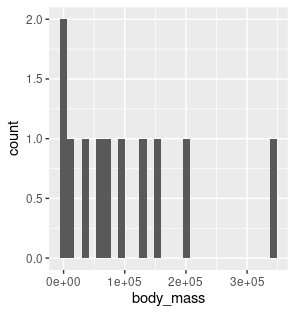
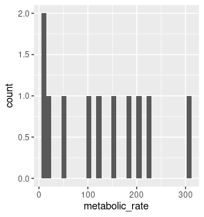
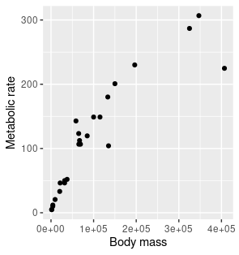
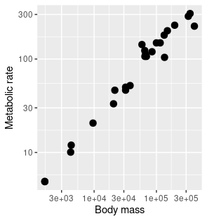
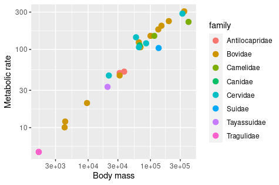
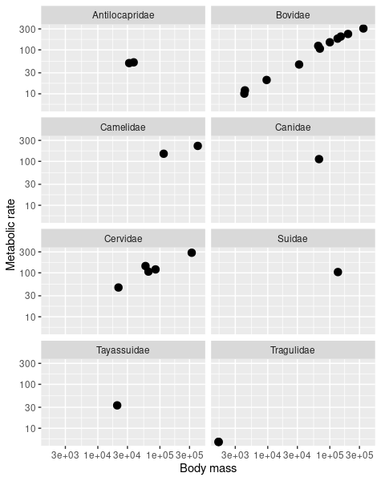
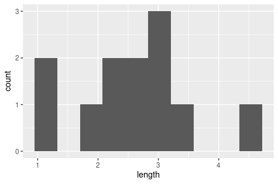
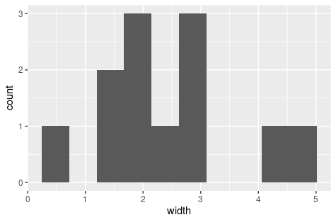
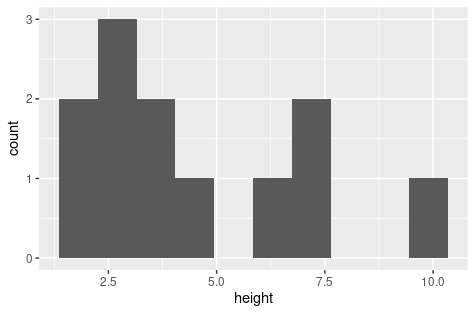

```{r setup, include=FALSE}
knitr::opts_chunk$set(echo = F, eval=T)
```

## Part 1: body mass and metabolic rate


```{r ex1}
#install the tidyverse package here
#after you do this, you can comment the line so it doesn't reinstall this every time you knit your document.
#install.packages("tidyverse")
#then, load the tidyverse package here
suppressMessages(library(tidyverse))
```

**Ex.2)**

Expected output:

```{r ex2}
# type your code here
mass_metabolism<-read_csv("mass_metabolism.csv")
head(mass_metabolism)
```


**Ex.5)**

```{r ex5}
# type your code here
str(mass_metabolism)
```

**Ex.6)**

Expected output:

```{r ex6}
# type your code here
mass_metabolism2<-mass_metabolism %>% mutate(family=factor(family))
levels(mass_metabolism2$family)
mass_metab_levels<-levels(mass_metabolism2$family)
mass_metab_levels
```


**Ex.9)**

Expected output:

```{r ex9}
range_mass<-mass_metabolism %>% summarise(range=diff(range(body_mass)))
range_mass
range_mass_bovidae<-mass_metabolism %>% filter(family=="Bovidae") %>% summarise(range=diff(range(body_mass)))
range_mass_bovidae
```

**Ex.10)**

Expected output:


```{r}

```

**Ex.11)**

Expected outputs:


```{r ex11}
range_metab<-mass_metabolism %>% summarise(range=diff(range(metabolic_rate)))
range_metab
range_metab_bovidae<-mass_metabolism %>% filter(family=="Bovidae") %>% summarise(range=diff(range(metabolic_rate)))
range_metab_bovidae
```


**Ex.12)**

Expected output:

```{r}

```

**Ex.13)**

Expected output:

```{r}

```

**Ex.14)**

Expected output:


```{r}

```


**Ex.15)** 

Expected output:

```{r}

```


**Ex.16)**

Expected output:

```{r}

```

**Ex.17)**

Expected output:

```{r ex17, eval=TRUE}
body_mass_summary<-mass_metabolism2 %>% group_by(family) %>% summarise(
  N=n(),
  Range_body_mass=diff(range(body_mass))
)
body_mass_summary
```

----------

## Part 2: Carbon storage in shrubs

**Ex.18)**

Expected output:

```{r ex18}
# type your code here
shrubs<-read_csv("shrub-volume-data.csv")
head(shrubs)
dim(shrubs)
str(shrubs)
shrubs2<-shrubs %>% mutate(site=factor(site), experiment=factor(experiment))
summary(shrubs)
summary(shrubs2)
```

**Ex.19)**

Expected outputs:

```{r ex19}
shrubs3<-shrubs2 %>% na.omit()
shrubs3
```

```{r ex19-a}

```


```{r ex19-b}

```


```{r ex19-c}

```


**Ex.20)**

Expected output:

```{r ex20}
shrubs3_summ<-shrubs3 %>% group_by(experiment) %>% summarise(N=n(), Range_length=diff(range(length)), Range_width=diff(range(width), Range_height=diff(range(height))))
shrubs3_summ
```

**Ex.21)**

Expected output:

```{r ex21}
#type your code here
shrubs4<-shrubs3 %>% mutate(area=width * length) %>% filter(height > 5) %>% arrange(length)
shrubs4
```


**Ex.22)**

Expected output:

```{r ex 22}
#type your code here
shrubs5<-shrubs3 %>% filter(height>4 & width>2)
shrubs5

```


**Ex.23)**

Expected output:

```{r ex23}
#type your code here

shrubs6<-shrubs3 %>% filter(experiment ==1 | experiment == 2)

shrubs6
```


**Ex.24**

Expected output:

```{r ex24}
shrubs %>% filter(!is.na(height))
```

**Ex. 25)**

Expected output:

```{r ex25}
shrub_volumes<-shrubs %>% mutate(area=width*length, volume=length*width*height)
shrub_volumes
```


