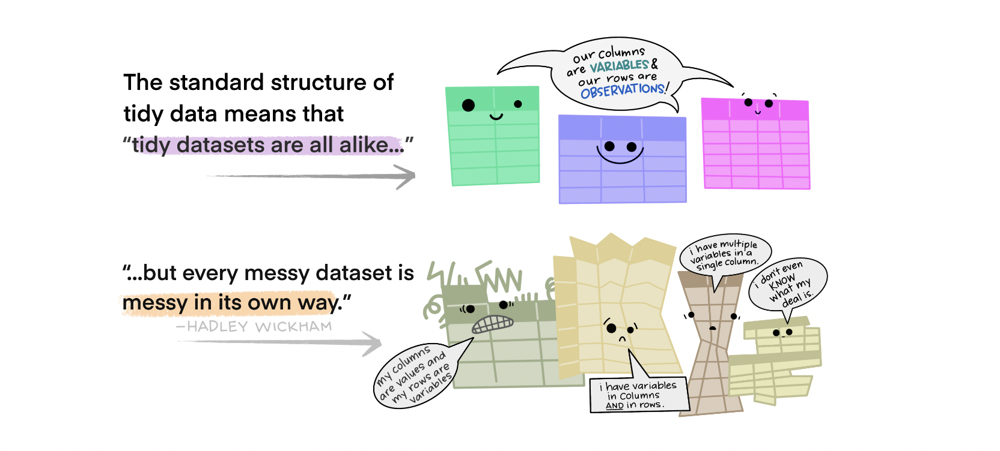
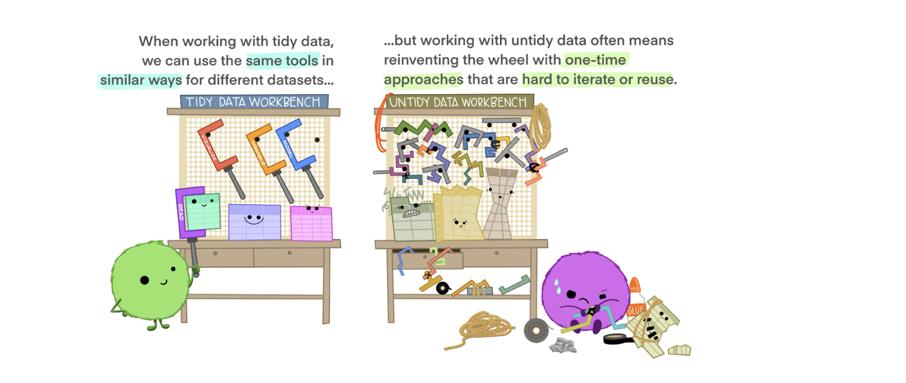

```{r setup, include=FALSE}
knitr::opts_chunk$set(eval = F)
library(ggplot2)
library(dplyr)
library(datasets)
library(tidyverse)
```

Parts of this tutorial come from Y. Brandvain's Applied Biostatistics Bookdown, Whitlock & Schuster's R Labs, and Rstudio Cloud's Primers


## What you know already

In Labs 1-2 you learned:

* About three data types of variables : factors, strings or characters, numeric.
* How to use R as a calculator.
* About four data structures in R: vectors, matrices, data.frames, and lists. (the only missing is: arrays) 
* How to create vectors, matrices, and data.frames and index their elements.
* How to create a basic  R script with code and comments.
* How to read into data saved in a a tabular format (e.g. csv)
* How to have a general look at the imported data and understand its structure
* How to extract parts of the data for further analysis

## Outline for today

* Learn about another type of script to write R code and text: R markdown
* Learn how to handling missing data in some of the functions we've learned so far. 
* Learn about the ideal ways to save data files for analysis in R.
* A soft introduction to the Tidyverse suit of packages, focusing on the `dplyr` and `ggplot` packages.
* Using `dplyr` to manipulate data, in particular the functions: `filter`, `select`, `arrage`, `mutate`, and `summarise`
* Using `ggplot2` to create figures, in particular: histograms, barplots, scatter plots, violin plots and boxplots

## Learning Outcomes

* Learn to create R markdown files in Rstudio.
* Learn how missing data is handled by R.
* Learn how to make your data "tidy"
* Learn how to write a file containing the processed data
* Learn how to perform routine data wrangling tasks with `dplyr` core functions: `filter`, `select`, `mutate`, `arrange`, `transmute`, `summarise`
* Pipe `%>%` these operations together.
* Know the basics of how to make graphs in R, such as histograms, strip charts, bar plots, violin plots, box plots, and scatter plots.
* Be able to suggest improvements to basic graphs to improve readability and accurate communication
* Explain the idea of mapping data onto aesthetics, and the use of different `geoms`.
* Match common plots to common data type.
* Use `geoms` in ggplot to generate the common plots (above).


## Tasks

* Understand Lab Assignment I
* Take very shot R markdown walkthrough
* Watch the other two videos about R Markdown 
* Open an R markdown script and keep notes in that format from now on.
* Complete the rest of this tutorial.
* Complete the Data Camp Activities set as due 09/21.(if not today then by next lab)
* Complete the R quiz 3 (will be posted by tomorrow on Moodle).


## Lab Assignment I

We will go over this together. 


* Open the "Lab Assignment I (phagocytes) project" under "Lab Assingments"
* Have a look at the spread sheet
* Have a look at the Readme.txt file
* Have a look at the .Rmd template file
* If you haven't done so already, read the LA1 instructions (Moodle) as soon as possible
* Have a look at the experimental system which will be shown in class

## R markdown

1. Take this [short tutorial](https://rmarkdown.rstudio.com/lesson-1.html) from Rstudio about the basics of R markdown (you can go up until "Notebooks" but no need to work through the final 4 steps starting at ("slide presentations").

2. Here is a very useful [R Markdown cheatsheet](https://rmarkdown.rstudio.com/lesson-15.html).

No need to watch these now, but try to watch them before you start working on LA1.
(these are also posted in the assignment instructions)

* [What is R Markdown](https://capture.dropbox.com/8iVT7yksrItSTpkW)
* [Using R markdown in Rstudio](https://www.youtube.com/watch?v=DNS7i2m4sB0&feature=youtu.be)
* [Overview of R markdown](https://www.youtube.com/watch?v=mcTB7h9lpCg&feature=youtu.be)

Optional for this Lab:

* DataCamp has an entire course on how to use R markdown. I assigned the first two chapters for next lab but you are welcome to start working on it sooner since it migth help with LA1. 

## Missing Data

Sometimes we do not have all variables measured on all individuals in the data set. When this happens, we need a space holder in our data files so that R knows that the data is missing. The standard way of doing this in R is to put “NA” (without the quotes) in the location that the data would have gone. NA is short for “not available”.

For example, in the Titanic data set, we do not know the age of several passengers. Let’s look at it. Use `read.csv` to read in the `titanic.csv` file from the `data` directory:

```{r}
titanicData <- read.csv("data/titanic.csv", stringsAsFactors = TRUE)
```


Now look at age by selecting the column `age` in the `titanicData` object:

```{r}
#Have R print out the list of the age variable,
#which you can do easily by just indexing it using the $ sign.
titanicData$age
```


If you look through the results, you will see that most individuals have numbers in this list, but some have NA. These NAs are the people for which we do not have age information.

By the way, the `titanic.csv` file simply has nothing in the places where there is missing data. When R loaded it, it replaced the empty spots with NA automatically.

We have already seen in lab 2 how to calculate the mean of a vector of data using `mean()`. Unfortunately, if there are missing data we need to tell R how to deal with it.

A (somewhat annoying) quirk of R is that if we try to take the mean of a list of numbers that include missing data, we get an NA for the result!


```{r}
mean(titanicData$age)
```

To get the mean of all the numbers that we do have, we have to add an option to the mean() function. This option is `na.rm = TRUE`:


```{r}
mean(titanicData$age, na.rm = T)
```

This tells R to remove (“rm”) the NAs before taking the mean. It turns out that the mean age of passengers that we have information for was about 31.2.

`na.rm = TRUE` can be added to many functions in R, including `median()`, as we shall see next.

The median of a series of numbers is the “middle” number – half of the numbers in the list are greater the median and half are below it. It can be calculated in R by using median().

```{r}
median(titanicData$age, na.rm = TRUE)
```


A handy function (which you've seen in Lab 2) that will return both the mean and median at the same time (along with other information such as the first and third quartiles) is `summary()`.

```{r}
summary(titanicData$age)
```

From left to right, this output gives us the smallest (minimum) value in the list (“Min.”), the first quartile (“1st Qu.”), the median, the mean, the third quartile (“3rd Qu.”), the largest (maximum) value (“Max.”), and finally, the number of individuals with missing values (”NA’s”).

* The first quartile is the value in the data that is larger than a quarter of the data points. 
* The third quartile is larger than ¾ of the data. 
* These are also called the 25th percentile and the 75th percentile, respectively. (You may remember these from boxplots, where the top and bottom of the box mark the 75th and 25th percentiles, respectively.)

### Measures of variability

In Lab 2 we saw variance and standard deviation. Today we will also see coefficient of variation and interquartile ranges. We will look into all of these when there are missing data. 


To calculate the *variance* and *standard deviation* of data with NAs, use `na.rm=T`:

```{r}
var(titanicData$age)

var(titanicData$age, na.rm = TRUE)

sd(titanicData$age)

sd(titanicData$age, na.rm = TRUE)

```

### Coefficient of variation

Surprisingly, there is no standard function in R to calculate the coefficient of variation. You can do this yourself, though, directly from the definition:

```{r}
100 * sd(titanicData$age, na.rm = TRUE) / mean(titanicData$age, na.rm = TRUE) 

```

Make sure you understand the command above before continuing!


### Range and interquartile range

Another handy function is `range`. But if we try to run it on our data, we get a discouraging result.

```{r}
range(titanicData$age)

```

Can you imagine how to solve this? You guessed correctly:

```{r}
range(titanicData$age, na.rm = T)
```
This will output the minimum and maximum values in the vector `titanicData$age`.

The interquartile range (or IQR) is the difference between the third quartile and the first quartile; in other words the range covered by the middle half of the data. It can be calculated easily with IQR().

```{r}
IQR(titanicData$age, na.rm = TRUE)

```


Note: you can also obtain the quartiles and IQR by running `summary` on the data. You don't need to use `na.rm=T`. In fact, summary will actually report whether there are missing data or not. The third quartile is 41 and the first quartile is 21, so the difference is 41 – 21 = 20:

```{r}
summary(titanicData$age)

```

The `summary()` function told you that `titanicData$age` has 680 values that are NAs. What proportion of values are NAs?

```{r}
680/length(titanicData$age) #divide the nr of NAs by total length
```

More generally, you might not want to have to type in that number yourself. How can you ask R whether an element in the vector is NA or not?

```{r}
is.na(titanicData$age)[1] #boolean. Asks if first element of vector is NA

is.na(titanicData$age) # returns a boolean vector with TRUE/FALSE for each position
```

Okay, but what if you wanted to know *which* elements of this vector are NAs? 

```{r}
titanicAgeNAs<-which(is.na(titanicData$age))
titanicAgeNAs
```
The command `which` gives the TRUE indices of a logical object. For every position where `is.na(titanicData$age)` returned `TRUE`, `which` will tell you the index of that element.

Finally, you can use `titanicAgeNAs` as index for `titanicData$age` and it will return all positions in the vector that are NAs:

```{r}
titanicData$age[titanicAgeNAs]
```

So going back to the question of hwo to calculate the proportion of elements in `titanicData$age` that are NAs, you could do:

```{r}
sum(is.na(titanicData$age))/length(titanicData$age)
```

The `sum()` command on a boolean will count each `TRUE` instance as a `1` and each `FALSE` instance as a `0`.

What if you wanted to get rid of all the rows in your data.frame that have NA in any of the columns?

```{r}
nrow(titanicData) #number of rows in the object
titanicData2<-na.omit(titanicData)
nrow(titanicData2) #number of rows in the object minus the rows with NAs
#make sure this makes sense
nrow(titanicData)-nrow(titanicData2)


```

This gives `680`, exactly the number of NAs for variable `age`, which tells us that none of the other columns have NAs in other rows, since `na.omit()` acts on the entire data.frame.


## A soft intro to the Tidyverse packages

*Note*: most of the material in this section comes from three sources: Rstudio, [Y. Brandvain's online book](https://bookdown.org/ybrandvain/Applied_Biostats_Fall_2022/viz1.html)
A great part about R is that many people have written packages to help with specific tasks.

The tidyverse refers to both a set of packages, and a way to do things in R. The tidyverse packages we use the most in this course are:

`ggplot2`: For making plots.
`dplyr`: For summarizing and handling data.
`tidyr`: For converting data from wide to long format (and vice versa).
`readr`: For reading in data.
`forcats`: For controlling the order of categorical variables.

We will use the tibble, stringr, and purrr packages less often if at all (although I use them often). But `ggplot2` and `dplyr` are crucial in this day and age.

{width=70%}


Why? One major reason for this is that the focus on a shared and coherent philosophy, grammar and data structure makes the tidyverse easier to teach and learn than base R. However, there are still challenges to learning and teaching the tidyverse, the two major challenges are

It takes time to learn and appreciate the shared philosophy and data structure.
Many people first learned R using base R, so it can be frustrating to start to learn again.
Overcoming challenge (1) takes time but is helped by reflecting on why and how code works when it works, and fails when it fails (rather than copying and pasting code that works), and continually asking questions.

## A note about tibbles

“Tibbles” are a new modern data frame. It keeps many important features of the original data frame. It removes many of the outdated features. They are another amazing feature added to R by Hadley Wickham. We will use them in the tidyverse to replace the older outdated dataframe that we just learned about.


If you use `readr::read_csv` to read in a .csv file, instead of the default base R `read.csv`, your data will be imported as a tibble.

```{r}
library(readr)
data_link <- "https://raw.githubusercontent.com/ybrandvain/datasets/master/FlowerColourVisits.csv"
flower_visits  <- readr::read_csv(file = data_link) # get the data into R and assign it to flower visits
```

Notice that whem data is read in as `tibble`, it gives you some summary info. Normally you'd have to run additional commands to see those.


### Compared to Data Frames

* A tibble never changes the input type.
* No more worry of characters being automatically turned into strings.
* A tibble can have columns that are lists.
* A tibble can have non-standard variable names.
* Can start with a number or contain spaces.
* To use this refer to these in a backtick.E.g. "my_dataframe$`0 weird col name`"
* It never creates row names.

## Structure of a good data file

Data files appear in many formats, and different formats are sometimes preferable for different tasks. But there is one way to structure data—called “long” format—that is extremely useful for most things that you will want to do in statistics and R.

Long format is actually very simple. Every row in the data set is a unique individual. Every column is a variable being measured on those individuals.

For example, here are some data about the tongue and palate lengths of several species of bats. There are three variables in that data set, the species name, tongue length, and palate length. Here each “individual” is a species. Here is that data in long format—each row is an individual. There are three columns, one for each variable:

```{r}
bat_tongue<-read.csv("data/BatTongues.csv")
str(bat_tongue)
```

### Creating a data file

When you have new data that you want to get into the computer in a format that R can read, it is often easiest to do this outside of R. A spreadsheet program like Excel (or a freely available program like OpenOffice Calc) is a straightforward way to create a .csv file that R can read.

In your spreadsheet program, open a new window with New Workbook under the File menu. (In OpenOffice, under the File menu, choose New and then Spreadsheet.) In the first row of your new spreadsheet, write your variable names, one for each column. (Be sure to give them good names that will work in R. Mainly, don’t have any spaces in a variable name and make sure that it doesn’t start with a number or contain punctuation marks. See Week 1 for more about naming variables.)

On the rows immediately below that first row, enter the data for each individual, in the correct column. Here’s what the spreadsheet would look like for the bat data after they are entered:


## Saving as .csv

Saving a spreadsheet in a format that R can read is very straightforward. In these labs, we are using .csv files (which stands for comma separated values). Once you have made your spreadsheet, under “File” click on “Save as…”. This will open a dialog box. First, give the file a name with the extension .csv at the end. We used “BatTongues.csv”. Then choose what folder you want to save the file in.

Finally, choose the right format for the file. The right format is “Comma separated values” which you can choose from after Format: in the dialog box. It might look something like this:

{width=50%}

In the resulting file, the first line will be a header that lists the names of each column (variable). After that there will be one line for each individual. All the variable names in the first row and the variable values in the later rows will be separated by commas, hence the name of the format. If you opened the .csv file in a text editor, it would look like this:

{width=60%}

## Tidy data

Above we introduce the tidyverse ecosystem of tools for R. Tidyverse tools can be useful and general because they rely on a certain and predictable data structure known as “tidy data.”

Characteristics of tidy data

* Each variable must have its own column.
* Each observation must have its own row.
* Each value must have its own cell.


{width=80%}


{width=70%}


A major benefit of the tidy data structure is that when data structure is reliable, we can deal with diverse data sets in a consistent way.


{width=70%}


When handed data to analyze, it is good practice to ask yourself if it is tidy. If it isn't, you can modify it and save a new version after you've processed it. How?

There are many ways but here is one. Let's say you wanted to change something about `flower_visits` and then save that as a new file.

```{r}

head(flower_visits) #this you know
#change column name from "flower" to "Flower.ID"

colnames(flower_visits)[1]<-"Flower.ID"
head(flower_visits)

write.csv(x = flower_visits, file = "my_flower_visits.csv", quote = F, sep = ",") #write a file with comma separated columns and do not quote characters/strings
```

If you look at the `files` pane on the right you should now see your file there. Voilà! You changed a dataset to your liking without changing the raw data. 

*_NEVER CHANGE RAW DATA!!!!!NEVER CHANGE RAW DATA!!!!!NEVER CHANGE RAW DATA!!!!!NEVER CHANGE RAW DATA!!!!!_*

## The dplyr package 

* Note* : most of the material in this section comes from three sources: Rstudio, [Y. Brandvain's online book](https://bookdown.org/ybrandvain/Applied_Biostats_Fall_2022/viz1.html), and the [R Labs from your textbook.](https://whitlockschluter3e.zoology.ubc.ca/RLabs/index.html)

{width=80%}

(That's a buddy of mine on the tweet! And I agree)

We will learn about several useful functions for data wrangling from the dplyr package, including: `filter`, `mutate`, `select`, `summarise`, and a few others.

### filter()

`filter()` lets you use a logical test to extract specific rows from a data frame. To use `filter()`, pass it the data frame followed by one or more logical tests. `filter()` will return every row that passes each logical test.

Let's use the `iris` dataset from the `datasets` package. 

```{r iris-setup, echo = T}
library(dplyr)
data(datasets::iris)
```

Check the structure of the object:
```{r}
str(iris)
head(iris)
summary(iris) # 50 individuals of each of 3 species
```

Here is a new function to have a glimpse of your data, from the dplyr package:

```{r}
library(dplyr)

glimpse(iris)
```

Compare this with `strc()`:

```{r}
str(iris)
```


Check what are the levels for `Species`:

```{r}
#the names here refer to the second part of the species name, after the genus, Iris. 
levels(iris$Species) #Iris setosa, Iris versicolor, Iris virginica
```


We can use `filter()` to select only the rows concerning "virginica".

```{r}
library(dplyr) # you need to do this because there are other packages with functions called "filter" and R can get confused.
filter(iris, Species == "virginica")
#another way to avoid confusions for R is to call the package before the function name, like this:
dplyr::filter(iris, Species == "virginica")
```

What if you only wanted to see rows where the Species is "virginica" AND the Petal.Width is lower than 2?

You can combine filters:

```{r}
filter(iris, Species == "virginica", Petal.Width<2)
#or
filter(iris, Species == "virginica" & Petal.Width<2) #this is the equivalent to the line above. "&" signifies AND in the world of logical operators, whereas | signifies OR.
```

Like all dplyr functions, `filter()` returns a new data frame for you to save or use. It doesn't overwrite the old data frame.

Caution! If you give `filter()` more than one logical test, `filter()` will combine the tests with an implied "and." In other words, `filter()` will return only the rows that return `TRUE` for every test. You can combine tests in other ways with Boolean operators...

R uses boolean operators to combine multiple logical comparisons into a single logical test. These include `&` (_and_), `|` (_or_), `!` (_not_ or _negation_), and `xor()` (_exactly or_).

Both `|` and `xor()` will return TRUE if one or the other logical comparison returns TRUE. `xor()` differs from `|` in that it will return FALSE if both logical comparisons return TRUE. The name _xor_ stands for _exactly or_.


We saw this in Lab1, so if you need to recap that, it might be a good idea...


If you want to save the output of `filter()`, you'll need to use the assignment operator, `<-` (or `=`).

Rerun the previous command and save the output to an object called `virg_filt`:
```{r}
virg_filt<-filter(iris, Species == "virginica", Petal.Width<2)
```

Good job! You can now see the results by running the name virg_filt by itself. Or you can pass `virg_filt` to a function that takes data frames as input.

Did you notice that this code used the double equal operator, `==`? `==` is one of R's logical comparison operators. Comparison operators are key to using `filter()`. Let's look at an example using the OR operator.

Suppose you wanted to filter the rows of `iris` that have either "virginica" OR "setosa" in the `Species` column:

```{r}
filter(iris, Species == "virginica" | Species == "setosa")
```

To check that this worked you could save the output into a variable and then `table()` the `Species` column:

```{r}
virg_set_filt<-filter(iris, Species == "virginica" | Species == "setosa")
table(virg_set_filt$Species)
```

The `table()` command counts how many occurences of each level of a factor exist in your data. Notice that although there are zero occurrences of "versicolor" in your object, the level exists because it is inherited from the parent object.

### Common mistakes

In R, the order of operations doesn't work like English. You can't write `filter(iris, Species == "setosa" | "virginica")`, even though you might say  "finds all measurements from I. setosa or I. virginica". Be sure to write out a _complete_ test on each side of a boolean operator.

Here are two more tips to help you use logical tests and Boolean operators in R:

##

1. A useful short-hand for this problem is `x %in% y`. This will select every row where `x` is one of the values in `y`. We could use it to rewrite the code in the question above:

```{r}
    set_or_virg <- filter(iris, Species %in% c("setosa", "virginica"))
```

2. As well as `&` and `|`, R also has `&&` and `||`. Don't use them with `filter()`! You'll learn when you should use them later.

### filter() and NAs

`filter()` only includes rows where the condition is `TRUE`; it excludes both `FALSE` and `NA` values. If you want to preserve missing values, ask for them explicitly:

```{r}
df <- data.frame(x = c(1, NA, 3))
filter(df, x > 1)
filter(df, is.na(x) | x > 1) #is.na(x) OR x >1
```

Another useful dplyr filtering helper is `between()`. What does it do?

```{r}
between(iris$Sepal.Length,5,6)
```
If you add the command `which`, you get the index of the positions in the vector that fullfill the requirement of being between 5 and 6.

```{r}
which(between(iris$Sepal.Length,5,6))
```

{width=70%}

### Add new variables with mutate()

A data set often contains information that you can use to compute new variables. `mutate()` helps you compute those variables. Since `mutate()` always adds new columns to the end of a dataset, we'll start by creating a narrow dataset which will let us see the new variables.

### select()

You can select a subset of variables by name with the `select()` function in `dplyr`. Run the code below to see the narrow data set that `select()` creates.

### mutate()

The code below creates two new variables with dplyr's `mutate()` function. `mutate()` returns a new data frame that contains the new variables appended to a copy of the original data set. Take a moment to imagine what this will look like, and then click "Run Code" to find out.


```{r}
iris_sepal <- select(iris,
  Sepal.Length,
  Sepal.Width,
  Species)
```

The code below creates two new variables with dplyr's `mutate()` function. `mutate()` returns a new data frame that contains the new variables appended to a copy of the original data set. Take a moment to imagine what this will look like, and then click "Run Code" to find out.

```{r}
iris_sepal <- select(iris,
  Sepal.Length,
  Sepal.Width,
  Species)

mutate(iris_sepal, leng_wid_ratio = Sepal.Length/Sepal.Width)
```
### transmute()

```{r}
iris_sepal <- select(iris,
  Sepal.Length,
  Sepal.Width,
  Species)

transmute(iris_sepal, leng_wid_ratio = Sepal.Length/Sepal.Width)
```
### summarise()

`summarise()` collapses a data frame to a single row of summaries. You get to choose how many summaries appear in the row and how they are computed:

```{r}
titanicData<-read.csv("data/titanic.csv", stringsAsFactors = F)
head(titanicData,2)
require(dplyr) #again, this makes R less confused about where the function "summarise" is coming from
summarise(titanicData, Nr_Female = sum(sex=="female" & survive == 'yes', na.rm = TRUE),
                  Nr_total = sum(survive == 'yes', na.rm = TRUE) )
```

(We'll come back to what that `na.rm = TRUE` means very shortly.)

Notice that the syntax of `summarise()` is similar to `mutate()`. As with `mutate()`, you give summarise:

1. The name of a data frame to transform
2. One or more column names to appear in the transformed output. Each column name is set equal to the R expression that will generate the content of the column.

The main difference between `summarise()` and `mutate()` is the type of function that you use to generate the new columns. `mutate()` takes functions that return an entire vector of output (to append to the original data frame). `summarise()` takes functions that return a single value (or summary). These values will appear in a new data frame that has only one row.

`mutate()` will always return the new variables appended to a copy of the original data. If you want to return only the new variables, use `transmute()`. 

### arrange()


You might recall that arranging data in R can be quite cumbersome. Let's look at `iris` again and try to rearrange the data.frame so that it's ordered by Petal.Length (smallest to highest value).

One way to do this:

```{r}
order(iris$Petal.Length) #this gives you the index of the Petal.Length vector in the order they should be if the vector was ordered.

iris$Petal.Length[order(iris$Petal.Length)] #this orders the column Petal.Length only

iris[order(iris$Petal.Length),] #order the entire data.frame based on the column Petal.Length

```

Now the `arrange` way:

```{r}

arrange(iris, Petal.Length) #that's all!

arrange(iris, -Petal.Length,) #this arranges it by descending petal length values

```


## Using the pipe `%>%` operator

In the previous section we learned how to do a bunch of things to data. For example, in our toad dataset, below, we

Use the mutate() function made a new column for BMI by dividing weight by height.
Sort the data with the arrange() function.
We also saw how we could select() columns, and filter() for rows based on logical statements.

We did each of these things one at a time, often reassigning variables a bunch. Now, we see a better way, we combine operations with the pipe `%>%` operator.

Say you want to string together a few things – like you want make a new tibble, called `sorted_titanic` by:

* Only retaining people with age `>` 15
* Calculating the proportion of females who survived
* Sorting the data by age
* Getting rid of the column with the home_destination

The pipe operator, %>%, makes this pretty clean by allowing us to pass results from one operation to another.

%>% basically tells R to take the data and keep going!

```{r}
sorted_titanic <- titanicData     %>% # initial data
  na.omit()  %>% #omit rows containing NAs
  dplyr::filter(survive == "yes") %>% # sruvived
  dplyr::filter(age > 15)         %>% #age >15
  dplyr::mutate(PropF = sum(sex=='female')/length(sex))   %>% # calculate PropF
  dplyr::arrange(age)                    %>% # sort by age
  dplyr::select(-home_destination)             # remove home destination

sorted_titanic

glimpse(sorted_titanic)

dim(titanicData) #dimensions: # rows &  # cols

dim(sorted_titanic)
```

## The ggplot2 package

*Note: most of the material in this section comes from Y. Brandvain's Applied Biostatistics online book. *

We generally think of two extremes of the goals of data visualization

In _exploratory_ visualizations we aim to identify any interesting patterns in the data, we also conduct quality control to see if there are patterns indicating mistakes or biases in our data, and to think about appropriate transformations of data. On the whole, our goal in exploratory data analysis is to understand the stories in the data.


In _explanatory_ visualizations we aim to communicate our results to a broader audience. Here our goals are communication and persuasion. When developing explanatory plots we consider our audience (scientists? consumers? experts?) and how we are communicating (talk? website? paper?).

The `ggplot2` package in R is well suited for both purposes of data visualization. Today we focus on exploratory visualization in `ggplot2` because:

* They are the starting point of all statistical analyses.
* You can do them with less `ggplot2` knowledge.
* They take less time to make than explanatory plots.
* Later in the term we will show how we can use `ggplot2` to make high quality explanatory plots.

Whether developing an explanatory or exploratory plot, you should think hard about the biology you hope to convey before jumping into a plot. Ask yourself

* What do you hope to learn from this plot?
* Which is the response variable (we usually place that on the y-axis)?
* Are data numeric or categorical?
* If they are categorical are they ordinal, and if so what order should they be in?


*_The answers to these questions should guide our data visualization strategy, as this is a key step in our statistical analysis of a dataset. The best plots should evoke an immediate understanding of the (potentially complex) data. Put another way, a plot should highlight both the biological question and its answer._*

Before jumping into making a plot in R, it is often useful to take this step back, think about your main biological question, and take a pencil and paper to sketch some ideas and potential outcomes.

[Here](https://vimeo.com/747889723?embedded=true&source=vimeo_logo&owner=183870356) is a cool video by Y. Brandvain explaining how ggplot2 'thinks'.

`ggplot2` is built on a framework for building plots called the grammar of graphics. A major idea here is that plots are made up of data that we map onto aesthetic attributes.

Lets unpack this sentence, because there’s a lot there. 

Say we wanted to make a very simple plot e.g. observations for categorical data, or a simple histogram for a single continuous variable. Here we are mapping this variable onto a single aesthetic attribute – the x-axis.

[Here](https://ggplot2-book.org/introduction.html) is a book about `ggplot2` written by its creator, Hadley Wickham


The function `ggplot()` allows us to graph most kinds of data relatively simply. Its syntax is slightly odd but very flexible. We’ll show specific commands for several types of plots below.

To begin, remember to load the package ggplot2 with:

```{r}
library(ggplot2)
```

To make a graph with `ggplot()`, you need to specify at least two elements in your command:

* The first uses the function `ggplot()` itself, to specify which data frame you want to use and also which variables are to be plotted. 
* The second part tells R what kind of graph to make, using a `geom()` function. The odd part is that these two parts are put together with a + sign. It’s simplest to see this with an example. We’ll draw a histogram with `ggplot()` in the next section.


### Histograms
A histogram represents the frequency distribution of a numerical variable in a sample.

Let’s see how to make a basic histogram using the age data from the Titanic data set. Make sure you have loaded the data (using read.csv) into a data frame called titanicData.

```{r}
titanicData <- readr::read_csv("data/titanic.csv")
```

Here’s the code to make a simple histogram of age:

```{r}
ggplot(titanicData, aes(x=age)) + geom_histogram()
## `stat_bin()` using `bins = 30`. Pick better value with `binwidth`.
## Warning: Removed 680 rows containing non-finite values (stat_bin).
```

Notice that there are two functions called here, put together in a single command with a plus sign. The first function is `ggplot()`, and it has two input arguments. 

* Listed first is `titanicData`; this is the name of the data frame containing the variables that we want to graph. 
* The second input to ggplot is an `aes()` function. In this case, the `aes()` function tells R that we want age to be the x-variable (i.e. the variable that is displayed along the x-axis). (The aes stands for “aesthetics”,” but if you’re like us this won’t help you remember it any better.)
* The second function in this command is geom_histogram(). This is the part that tells R that the “geometry” of our plot should be a histogram.

This is not the most beautiful graph in the world, but it conveys the information. At the end of this lab we’ll see a couple of options that can make a ggplot graph look a little better.


### Bar graphs
A bar graph plots the frequency distribution of a categorical variable.

In `ggplot()`, the syntax for a bar graph is very similar to that for a histogram. For example, here is a bar graph for the categorical variable sex in the titanic data set. Aside from specifying a different variable for `x`, we use a different geom function here, geom_bar.

```{r}
ggplot(titanicData, aes(x=sex)) + geom_bar(stat="count")
```


### Boxplots
A boxplot is a convenient way of showing the frequency distribution of a numerical variable in multiple groups (i.e., a categorical variable). Here’s the code to draw a boxplot for age in the titanic data set, separately for each sex:

```{r}
ggplot(titanicData, aes(x=sex, y=age)) + geom_boxplot()
## Warning: Removed 680 rows containing non-finite values (stat_boxplot).
```

Notice that the `y` variable here is age, and `x` is the categorical variable sex that winds up on the x-axis. See the result below, and look at where the variables are. The other new feature here is the new geom function, `geom_boxplot()`.

Here the thick bar in the middle of each boxplot is the median of that group. The upper and lower bounds of the box extend from the first to the third quartile. (The “first quartile” is the 25th percentile of the data–the value which is bigger than 25% of the other values. The “third quartile” is the 75th percentile– the value bigger than 3/4 of the other values.)

The vertical lines are called whiskers, and they cover most of the range of the data (except when data points are pretty far from the median (see text), when they are plotted as individual dots, as on the male boxplot).

### Violin plots

They share many similarities with a boxplot, but unlike boxplots they show a mirrored image of the smoothed distribution of the numerical variable:
```{r}
ggplot(titanicData, aes(x=sex, y=age)) + geom_violin()
```

Violin plot with points (strip chart) overlaid:

```{r}
ggplot(titanicData, aes(x=sex, y=age)) + geom_violin() + geom_point()
```

This is not great for seeing the points because they are on top of each other, so we could add some jitter:

```{r}
ggplot(titanicData, aes(x=sex, y=age)) + geom_violin() + geom_jitter(width=0.2) #feel free to play with this width
```
### Scatterplots
The last graphical style that we will cover here is the scatter plot, which shows the relationship between two numerical variables.

The titanic data set does not have two numerical variables, so let’s use a different data set—the example from Figure 2.3-2 of Whitlock and Schluter, showing the relationship between the ornamentation of father guppies and the sexual attractiveness of their sons. You can load the data for that example with
```{r}
guppyFatherSonData <-read.csv("data/chap02e3bGuppyFatherSonAttractiveness.csv")
```

To make a scatter plot of the variables fatherOrnamentation and sonAttractiveness with ggplot, you need to specify the x and y variables, and use `geom_point()`:

```{r}
ggplot(guppyFatherSonData,   
  aes(x = fatherOrnamentation, 
  y = sonAttractiveness)) +
  geom_point()
```


### Better looking graphics
The code we have listed here for graphics barely scratches the surface of what ggplot, and R as a whole, are capable of. Not only are there far more choices about the kinds of plots available, but there are many, many options for customizing the look and feel of each graph. You can choose the font, the font size, the colors, the style of the axes labels, etc., and you can customize the legends and axes legends nearly as much as you want.

Let’s dig a little deeper into just a couple of options that you can add to any of the forgoing graphs to make them look a little better. For example, you can change the text of the x-axis label or the y-axis label by using xlab or ylab. Let’s do that for the scatterplot, to make the labels a little nicer to read for humans.

```{r}
ggplot(guppyFatherSonData,   
    aes(x = fatherOrnamentation, y = sonAttractiveness)) +
    geom_point() +
    xlab("Father's ornamentation") + 
    ylab("Son’s attractiveness")
```

The labels that we want to add are included in quotes inside the `xlab` and `ylab` functions. Here is what appears:

It can also be nice to remove the default gray background, to make what some feel is a cleaner graph. Try adding

```{r, eval=F}
+ theme_classic()
```
to the end of one of your lines of code making a graph, to see whether you prefer the result to the default design.

```{r}
ggplot(guppyFatherSonData,   
    aes(x = fatherOrnamentation, y = sonAttractiveness)) +
    geom_point() +
    xlab("Father's ornamentation") + 
    ylab("Son’s attractiveness") + 
    theme_classic()
```


### Getting help
The help pages in R are the main source of help, but the amount of detail might be off-putting for beginners. For example, to explore the options for `ggplot()`, enter the following into the R Console.

```{r}
help(ggplot)
#or
?ggplot2
```
This will cause the contents of the manual page for this function to appear in the Help window in RStudio. These manual pages are often frustratingly technical. What many of us do instead is simply google the name of the function—there are a great number of resources online about R.

There are also many introductory books available. A good one is Dalgaard (2008) Introductory Statistics with R, 2nd ed.

## Now let's practice!

Go to DataCamp and complete the following:

* Introduction to the Tidyverse: Data Wrangling
* Data manipulation with dplyr: Transforming Data with dplyr
* Introduction to the Tidyverse: Grouping & Summarising
* Introduction to the Tidyverse:  Data Visualization
* Introduction to Data Visualization with ggplot2: Introduction
* Introduction to Data Visualization with ggplot2: Aesthetics
* Exploratory Data Analysis in R: Exploring Categorical Data
* Exploratory Data Analysis in R: Exploring Numerical Data
* Reporting with R markdown: Getting Started with R markdown
* Reporting with R markdown: Adding analyses and visualizations
## Wrapping up

### Tips for retaining what you've been learning:

* Practice all lab materials by typing in commands
* Keep up with Data Camp (and explore more if you'd like)
* Look at the R resources under R! in our Moodle page and explore them (this includes more tutorials)
* Start using R for tasks, even if simple calculations or even for the problems from the problem sets.

When you are ready, take the R Quiz 3 on Moodle (it will be posted by the end of the day today).

