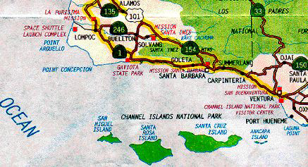

# Outline

Now that we've successfully covered the basic of R, we will focus more on 
hands-on activities (although we will still need to learn new skills)

# Tasks

* If you haven't done so, go over the exercises from lab 6
* Work in groups of 2-3 on Case Study #1
* Work in groups of 2-3 on Exercise #1: Making a distribution of sample means
* Work in groups of 2-3 on Exercise #2: Taking your first function to the next level!
* Complete R quiz 7

# Learning Goals

* Apply what you've learned so far to real case-studies
* Consolidate concepts learned in class with real data

# Case Study: Acorn size and oak tree range


## Introduction

It is thought that the size of a plant’s seed may have some effect on the geographic range of a plant. In fact, a positive correlation is believed to exist between acorn size and the geographical range of the North American Oaks. The idea behind this theory is that larger acorns will be carried away by larger animals who in turn have a wider territorial range. Aizen and Patterson studied 39 species of oak trees to examine this correlation.


## Protocol

Fifty species of oaks are found growing in the United States, 80% of which are accounted for in the Atlantic and California regions. The 28 oaks in the Atlantic region and the 11 oaks in the California region were used in this study. Acorn size was expressed as a volume, using measurements of specific nut lengths and widths to estimate the acorn volume as the volume of an ellipsoid. The areas of the geographical range for each species were obtained from the available literature.

The range of species number 11 of the California region is unusual in that it does not include any land on the continental United States. This particular species of oak grows only on the Channel Islands of Southern California (see the map) and the island of Guadalupe off the coast of Baja California. The area of the Channel Islands is 1014 sq. km and the area of the island of Guadalupe is 265 sq. km.



## Data

The data collected by Aizen & Patterson is provided in the file `acorn.txt`. The file `Readme_acorn.txt` describes what is in the data file.

## Analysis

For each of the questions below, use the appropriate code chunk.


### Question 1:

Look at the data file and the readme file and answer:

a) how many variables are present in the data file
b) which ones are numerical? (name the subtype)
c) which ones are categorical (name the subtype)
d) how are the columns separated in the data file?

### Question 2:

* Read in the data file and 
* check its dimensions 
* check its structure
* check that there are no missing values. 
* Do the classes of each column seem appropriate to you? Now is a good time to change them.


```{r}
#comment your code, always


```

### Question 3:

* a) What type of visualization would be appropriate in order to investigate the relationship between tree range and acorn size?
* b) Who are the response and explanatory variables here?
* c) Make that plot.

```{r}
#comment your code, always

```

### Question 4:
Examine the summary statistics for tree range. What are the mean and the standard deviation? What do these values tell you about the likely shape of the distribution?

```{r}
#comment your code, always


```


### Question 5:

a) Transform the data using the log transformation on both the range and the size. 

```{r}
#comment your code, always


```

b) Now make a scatter plot of Ln(range) vs. Ln(acorn size). 

```{r}
#comment your code, always


```


c) How did the pattern change? Does it surprise you? Do you see any obvious reason that might help explain the correlation?


d) Alternatively to a) and b), you could simply plot log versions of the variables with ggplot without having to change the data frame:

```{r}
#comment your code, always


```


### Question 6:

Compare boxplots of tree range by geographical region in order to investigate the relationship between tree range and region. What do you learn?

```{r}
#comment your code, always


```


### Question 7:

a) Make an appropriate plot of Ln(range) vs. Ln(acorn size) for the Atlantic region. Is the correlation any better than that found in Question 1?

```{r}
#comment your code, always


```

b) Make an appropriate plot of Ln(range) vs. Ln(acorn size) for the California region. What is the correlation? Why do you think that the correlation is so low?


```{r}
#comment your code, always


```

## Exercise 1: Making a distribution of sample means


Last week you learned how to take a sample (random rows) from a dataset and calculate statistics on it. Specifically, you took two independent samples from the `human_genes` dataset and calculated some descriptive statistics. If you didn't complete that activity, you should do so before moving forward. This is under Lab6_Activity in Rstudio Cloud but also posted on Moodle.

Today, you have two tasks:

a) take 10,000 random samples of length `n=100` from the `human_genes` dataset.
b) calculate the following descriptive statistics for each of the samples (for the gene length): `mean`, `median`,`standard deviation`, `mode`, `IQR`. 

Tips:

To do a): explore the function `replicate` from the `dplyr` package.

To do b): you did this in Lab 7.

```{r}
library(dplyr) #load dplyr

#summarise the human genes dataset creating three columns
human_genes_summ <- human_genes %>%
  summarise(
  MeanLength = mean(size),
  MedianLength = median(size),
  SDLength = sd(size),
  IQR = IQR(size)
)
human_genes_summ #this contains mean, median, and sd, but not iqr
```

c) plot a distribution of the means from all the samples

```{r}
#comment your code, always


```

d) calculate the standard deviation of the sampling distribution and compare it to the standard error you obtain by applying the standard formula $\sigma_{\bar X}=\frac{\sigma_{X}}{\sqrt{n}}$.

```{r}
#comment your code, always


```


## Exercise 2: Taking your first function to the next level!

In Lab 6, you created a simple function that takes in a user defined value and converts into something else. Specifically, the function convert a temperature in Celsius to the corresponding temperature in Fahrenheit. You were then asked to make a similar function that converts temperature in Fahrenheit to Celsius. If you didn't complete that activity, you should do so before moving forward. This is under Lab6_Activity in Rstudio Cloud but also posted on Moodle.

Today, you have two tasks:

1. Combine both functions into one. Basically, you want the function to have two arguments: temperature in Celsius and temperature in Fahrenheit. A few things to consider:

- only one of the two arguments should be provided by the user

- how does the function decide what to do based on the user input?  

- what happens if the user does not understand the function and provides both arguments?


## Recap from lab 6

Tips: 

* To do b): you will need to use conditional statements (if/then).

* To do c): the `return` command can be set to return a warning or error message.

```{r}
#function to convert Fahrenheit to Celsius
FtoC<-function(tf){ #one argument:t
tc<-(tf-32)/1.8
return(tc)
}
```

```{r}
#function to convert Fahrenheit to Celsius
CtoF<-function(tc){ #one argument:t
tf<- (tc + 32)
return(tf)
}
```

b) Apply your function to the "Temp" column to the `airquality` dataset from the `datasets` package.

* load the dataset
* check its structure
* use your function to convert temperatures from Fahrenheit to Celsius

```{r}
#comment your code, always
```

## R quiz 7

Instead of a quiz, you will complete the DataCamp assignment "Introduction to Writing Functions in R: All about arguments".
Note: make sure you complete the first chapter of that course before you attempt this one. The first one is part of Rquiz 6.

# References

EESEE Case Studies. [Acorn size and oak tree range.](https://media.saplinglearning.com/priv/he/stats/shared_resources/eesee_casestudies/acorn_size_and_oak_tree_range.htm) 

Aizen, M. A., & Patterson III, W. A. (1990). Acorn size and geographical range in the North American oaks (Quercus L.). Journal of Biogeography, 327-332

https://www.geeksforgeeks.org/how-to-calculate-a-bootstrap-standard-error-in-r/

