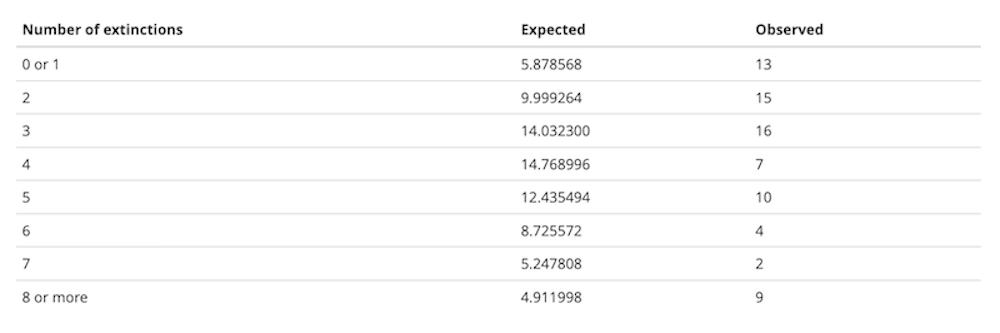

```{r setup, echo=F}
knitr::opts_chunk$set(echo=T, eval=T)
options(tinytex.verbose = TRUE)
suppressMessages(library(dplyr))
#load ggplot package
suppressMessages(library(ggplot2))
#load readr package
suppressMessages(library(readr))
```

# Outline

Today will be less about complicated coding and more about statistics. We will cover some brief statistical background for these tests but for a more in-depth overview and/or review, see these slides (link) 

We will learn how to run:
* One categorical variable: Chi-square goodness of fit tests
* Two categorical variables: Risk ratio, Odds Ratio,Chi-square independence test; Fisher's test; G-test

---

# 1. One variable: Chi-square goodness of fit tests

## Tools we will use 

* `table()`
* `chisq.test()`

A $\chi^2$ goodness-of-fit test compares the frequencies of values of a categorical variable to the frequencies predicted by a null hypothesis. 

### Example 1: 

For example, the file `MandMlist.csv` contains a list of all the colors of M&M candies from one package, under the variable “color”. Let’s ask whether this fits the proportions of colors advertised by the candy company.

* read in the `MandMlist.csv` file and call it MMlist
* use `head()` and `str()` to have a look at the data

### `table()`{-}

```{r ex1.1}
#read in the file and call is MMlist

#use head and str to check it

```

Notice that `MMlist$color` contains the color of each of 55 M&Ms

Summarizing frequency data in a table is useful to see the data more concisely, and such a table is also necessary as input to the $\chi^2$ test function. We can summarize the counts (frequencies) of a categorical variable with `table()`.

* Use the `table` function to summarize the colors of the M&Ms
* save the output to `MMtable`


```{r ex1.2}
#create MMtable

#look at it

```

This shows you how many M&Ms were blue, brown etc


### `chisq.test()`{-}

We can use a $\chi^2$ goodness-of-fit test to compare the frequencies in a set of data to a null hypothesis that specifies the probabilities of each category. In R, this can be calculated using the function `chisq.test()`.

The company says that the percentages are 24% blue, 14% brown, 16% green, 20% orange, 13% red and 13% yellow. This is our null hypothesis. Let’s test whether these proportions are consistent with the frequencies of the colors in this bag. R wants the proportions expected by the null hypothesis in a vector

* create a vector containing the expected proportions of each color of M&Ms according to the null hypothesis, in the following order: blue, brown, green orange, red, yellow
* name this vector `expected_proportions`

```{r ex1.3}
#create expected proportions

#check it

```

Notice that R wants you to input the expected proportions, which it will use to calculate the expected frequencies.

The first thing we need to do is check whether the expected frequencies (expected by the null hypothesis) are large enough to justify using a $\chi^2$ goodness of fit test. 

Recall the $\chi^2$ requirements:

* No more than 25% of the expected frequencies are less than 5
* None of the expected frequencies are less than 1

To obtain these expected counts, multiply the vector of the expected proportions by the total sample size. We can find the total sample size by taking the `sum() of the frequency table.

* use the function `sum()` on your frequency table `MMtable`
* save the output as `n_total`, the total sample size
* check the value

```{r ex1.4}
#create n_total

```

Now you can use the expected proportions and the total sample size to find the expected number (not proportion) of M&Ms of each color, given your sample size.

* multiply your sample size by the expected proportions to find the expected absolute values for each color
* save the output as `expected_counts`
* look at the values
* decide whether it's ok to proceed with a $\chi^2$ goodness-of-fit test or not, given the requirements above

```{r ex1.5}
#create expected counts

```

If all looks good, go ahead and run a $\chi^2$ goodness of fit test.

* The function `chisq.test()` requires two arguments in its input: a frequency table from the data (argument `x`) and a vector with the expected proportions from the null hypothesis (argument `p`). We have both.
* Input the parameter values using the objects you created above and run a $\chi^2$ test. Save the output in `my_chisq_test` and print the results.


```{r ex1.6}
#your code here

```

Now let's run the $\chi^2$ test manually for comparison!
Remember the $\chi^2$ formula:

$$\chi^2=\sum_{i}=\frac{(O-E)^2}{E}$$

Follow the following steps. Always check each intermediate value to make sure you understand what's going on.

* First, calculate O-E and call it `step1`. You have both of these saved as `MMtable` and `expected_counts`, respectively
* Then, square `step1` and call it `step2`
* Then, divide `step2` by the expected counts and call it `step3`
* Finally, use `sum()` to add all values in `step3`. Call that `step4`. This is your chi-square value.

```{r ex1.7}
#step 1

#step 2


#step 3


#step 4. This is your chi-square value


```

Lastly, we need to find the p-value corresponding to this value, so:

* now use the `pchisq` function to get the p-value. This function requires two arguments: the chi-square value ($q$) and the degrees of freedom ($df$). We have $q$ but we need to calculate $df$.

* define the degrees of freedom. Remember that for goodness of fit tests this is number of categories - 0 - 1. Use `length()` to find the number of categories in MMtable instead of manually typing that in. Save the degrees of freedom as `my_df`.

* run the `pchisq` function and save the output as `my_pchisq`. Make sure you change the argument `lower.tail` to `FALSE`. This has to do with the chi squared distribution that we get these probabilities come from. We want to look at the upper tail of the distribution because we want the probability that we got the calculated chi squared value or greater. If we did not include this argument, then `pchisq` would return the probability that the chi squared statistic is the one we calculated or less. After running `pchisq`, print `my_pchisq`.


```{r ex1.8}
#calculate df


#run pchisq using my_df and step4 as arguments. Set lower.tail to FALSE


```

Now you can compare the results you saved as `my_chisq_test` to the ones you calculated manually:

* run `names(my_chisq_test)` to see all the values that get stored from running the chi-square test.
* use `$` to extract the `p.value` and `statistic` values and compare them to 

```{r ex1.9}
#run names(my_chisq_test)

#check that the `statistic` value within my_chisq_test has the same value as step4

#check that the `p.value` value within my_chisq_test has the same value as my_pchisq

```

Congrats! Now let's run a goodness of fit test where the null hypothesis is that data follow a Poisson distribution.

### Poisson {-}

A $\chi^2$ goodness of fit test can be used to ask whether a frequency distribution of a variable is consistent with a Poisson distribution. This is a useful way to determine if events in space or time are not “random” but instead are clumped or dispersed.

It turns out that this is not a straightforward process in R. In this section, we’ll highlight a couple of functions in R that will streamline doing the calculations by hand. We’ll use the data on the numbers of extinctions per prehistoric time period described in Example 8.4 in the Whitlock and Schluter textbook (3rd edition).

Background (from the textbook): Do extinctions occur randomly through the long fossil record of Earth's history, or are there periods in which extinction rates are unusually high ("mass extinctions") compared with background rates? The best record of extinctions through Earth's history comes from fossil marine invertebrates, because they have hard shells and therefore lend to preserve well. 


* read in the `MassExtinctions.csv` dataset and call it `extinctData`.
* use `head()` to have a look at the data.
* use `dim()` to get the dimensions. Each row corresponds to one block of time. The numbers record how many extinction events were recorded in that time block.
* save the column `numberOfExtinctions` as `number_of_extinctions`. Print it.
* run `table()` on this object to get the absolute frequency of 1,2, etc extinction events across all blocks of time. Call it `table_extinctions`. Print it.


```{r ex1.10}
#read in the file as extinctData


#use head understand the dataset


#use dim to get the dimensions


#create number_of_extinctions


#run `table()` on this object to get the absolute frequency of 1,2, etc extinction events across all blocks of time.

```


Interpreting `table_extinctions`:The first row lists each possible number of extinctions in a time period, ranging from 1 to 20. The second row shows the number of time periods that had each number of extinctions. 

Questions:

* how many blocks of time are there?
* which frequency is most common across the time blocks?
* how many time periods had 2 or less extinctions? Hint: you can use the `which` function for this


```{r ex1.11}
# how many blocks of time are there?

# which frequency is most common across the time blocks?

#how many time periods had 2 or less extinctions? 

```


The mean number of extinctions per unit of time is not specified by the null hypothesis, so we need to estimate it from the data. 

* get the mean number of extinctions per time period and save it as `mean_extinctions`. Print it

```{r ex1.12}
#get the mean

#print it

```

We can now use this mean to calculate the probability according to a Poisson distribution of getting each specific number of extinctions.

Remember that under the Poisson, the probability of observing X successes occurring in any given block of time or space is:

$$P[X]=\frac{e^{-\lambda}\lambda^X}{X!}$$
Remember that lambda is simply the mean, which we've calculated.

Instead of using this equation to get the expected values for 0,1,...>20 extinction events, we will use the `dpois()` function.

### `dpois()`{-}

Fortunately, R has a function to calculate the probability of a given value under the Poisson distribution. This function is `dpois()`, which stands for “density of the Poisson”. `dpois()` requires two values for input, the mean (which is called lambda in this function) and x, the value of the outcome we are interested in (here, the number of extinctions). For example, the probability of getting `x = 3` from a Poisson distribution with mean `4.21` can be found from the following:

```{r}
dpois(x = 3, lambda = 4.21)
```

`dpois()` will accept a vector of x’s as input, and return a vector of the probabilities of those x’s. A convenient short hand to know here is that R will create a vector with a range of values with a colon. For example, 0:20 is a vector with the integers from 0 to 20.

```{r}
0:20
```

We’ll need the probabilities for all possible values of x from 0 to 20 (because this was the largest value observed in the data, for more on why this is necessary, reference the poisson distribution section of the slides). `dpois` requires two arguments: a vector with the number of successes (0,1, and so on) and the lambda value, which we calculated above (it's the mean).

* Create a vector containing numbers 0:20 and save it in an object `vals`
* use the `dpois` function using as the `x` argument the vector you just created and the lambda value you calculated above to get the expected probabilities. Save this as `expected_extinction_probabilities`. Print it.

```{r ex1.13}
# create vector

# run dpois to create expected_extinction_probabilities


```

The odd notation here is a shorthand for scientific notation. 1.48e-02 means $1.48\times10^2$. The $e$ stands for exponent.

Remember that we asked R to output the probability of values from 0 to 20. So the first value in this output corresponds to the probability of getting a zero, the second to the probability of getting a 1, etc.

In order to convert these probabilities into expected values for a $\chi^2$ test, we need to multiply them by the total sample size (which you've figured out above). Call this `expected_extinction_counts`. Print it.

```{r ex1.14}
#calculate expected_extinction_counts

#print expected_extinction_counts


```

Most of these values would cause problems for the $chi^2$ test because they are too small (less than 1). We need to combine categories in some reasonable way so that the expected frequencies match the assumptions of the $chi^2$ test. 

Let’s combine the categories for 0 and 1 successes, and combine everything greater than or equal to 8 into one category. It is possible to do this all in R, but you can also do it by hand, using the expected frequencies we just calculated. Here is a table of the expected frequencies for these new combined categories, for both the observed and expected, summing over all the possibilities within each of these groupings. (E.g., the expected frequency for the category “0 or 1” is the sum of 1.128324 and 4.750244.)


```{r}

```


Note that these expected values are large enough to match the conditions of the $\chi^2$ test.

* Make vectors (using `c()`) for the observed and expected values for these new groups. You can do this one manually by typing in the values shown above. 

```{r ex1.15}
#create expected_combined. I did this one for you. Just uncomment it.

#expected_combined <- c(5.878568, 9.999264, 14.032300, 14.768996, 12.435494,  8.725572, 5.247808, 4.911998)

#create observed_combined. You do this one


```

* From these we can calculate the $\chi^2$ test statistic using `chisq.test()`.
* The data (x) are `observed_combined`. We will use `expected_combined` as the argument `p`. But note that we are giving the list of expected frequencies rather the expected probabilities. Therefore, we need to give it the option `rescale.p = TRUE`. (an obvious alternative is to simply obtain the proportions first, and then use that for p as we did in the previous example with no need to rescale).
* Finally, we want to run `chisq.test()$statistic`: by adding `$statistic` at the end, R will only give us the $\chi^2$ value as output. (We don’t yet want the full results of the test because R does not know to correct for the reduction in degrees of freedom caused by estimating the mean.)

```{r ex1.16}
#run chisq.test()$statistic using the appropriate parameters as listed above.


```

This correctly calculates our $\chi^2$ value as 23.939. The warning message in red is because one of the expected values is under 5, but because this occurred in less than 20% of the categories, it is fine to proceed.

The degrees of freedom for this test are the number of categories minus the number of parameters estimated from the data minus one. We ended up using 8 categories and estimated one parameter from the data (mean/lambda), so we have df = 8 – 1 – 1 = 6.

### pchisq() {-}

To calculate the correct P-value, we need to know probability of getting a $\chi^2$ value greater than 23.939 from a distribution that has 6 degrees of freedom. let's use it as we did before, with `lower.tail=F`:

```{r ex1.17}
#run pchisq

```

Thus, our P-value for this test of the fit of these data to a Poisson distribution is approximately 0.0005. We reject the null hypothesis that these extinction data follow a Poisson distribution.

Try re-running the code in rex1.16 without $statistic

```{r ex1.18}
#code here

```

Notice that while the statistic value is correct, the p-value is different because it is using df=7, which is incorrect. 


---
# Two categorical variables

Here, we will learn how to look at, and test for, the association between two categorical variables. Let's use an example from a cool 

```{r}
brainData <- read.csv("titanic.csv", stringsAsFactors = TRUE)

```


The variables we’ll use are “sex” and “survive”. The variable ”survival” contains a “yes” if the individual survived the sinking and a “no” for those that did not.

Categorical variables in R are often treated as “factors.” You’lll notice that the read.csv() command above included an option stringsAsFactors=TRUE which tells R to treat all columns that include non-numeric characters to be treated as factors. There are several reasons why treating categorical variables in R as factors is beneficial, but here the most relevant is that factors allow us to set the order of different values or categories of the factors. This ordering will affect the order of appearance of these categories in tables and graphs. This order also matters for some calculations (such as odds ratios, below). The default order of categories is alphabetical, but you can change this.

To see the categories and their order for a factor variable, use the levels() command. For example, the default order of the categories “no” and then “yes” for the variable “survival” in the Titanic data set is alphabetical:

```{r}
levels(titanicData$survival)
```

We want to change the order so that the “yes” category for survive comes first when we use R to calculate the odds ratio below. This is to ensure that the probability of success (here, “yes”) is in the numerator. We change the order using the levels argument argument of the `factor()` command:

```{r}
titanicData$survival <- factor(titanicData$survival, levels = c("Survived", "Died"))
```

The above command saves the new ordering of categories in the data frame titanicData, overwriting the original variable “titanicData$survive”. To check the new order:

```{r}
levels(titanicData$survival)
```

### Frequency table {-}

A contingency table is an effective method to see the association between two categorical variables. Moreover, other R functions we will use in this exercise require a contingency table as input.

A frequency table can be created using `table()`. To create a contingency table that shows the relationship between two categorical variables:

* we simply give `table()` the vectors that contain those two variables. Put the explanatory variable first, and then the response variable after a comma.
* save this as `sex_survive_table`


```{r ex2.1}
sex_survive_table <- table(titanicData$sex, titanicData$survival)
sex_survive_table
```


This shows us that in the Titanic data set, there are 109 female passengers who did not survive, 316 females who did survive, and analogous information for the males.

Sometimes for contingency analysis we have already summarized the counts for each case. In these cases it is useful to be able to create a data table directly from these counts. The following syntax will allow you to create a data table directly:

```{r}
sex_survive_table_direct <- data.frame(yes = c(316,338), no = c(109,1329),
      row.names = c("female","male"))
sex_survive_table_direct
```

###Mosaic plots {-}

We learned in week 3 how to show associations between categorical variables like this using grouped bar graphs. The mosaic plot is another graphical technique for showing the association between two categorical variables. Here, each combination of the variables is represented by a rectangle, and the size of the rectangle is proportional to the number of individuals in that combination.

R has a function to calculate mosaic plots, with the sensible name `mosaicplot()`. In its most basic form, you just give it a frequency table as input.

```{r}

mosaicplot(sex_survive_table)

```


This shows the basic pattern. However, this plot can be greatly improved by adding a couple of extra options, to specify color and axes labels. We can add the option `color = c(“darkred”, “gold”)` to tell R which colors to use for the different response variables. This is a vector of color names that R assigns in the same order as the order of the categories of the variable plotted on the vertical axis (the response variable) starting with the topmost. (R has many named colors, including all the basics like “red”, “orange”, “blue”, etc.)

We would also like the axes to have labels. We can specify these with xlab and ylab as options. Let’s simply call the x-axis “Sex” and the y-axis “Survival”.


```{r ex2.2}
#make new mosaic plot with different colors and axis labels

```


It is much easier now to see in the graph that the majority of females survived whereas the majority of males did not.

### Odds ratios {-}

One of the ways to measure the strength of the association between two categorical variables is an odds ratio.

In R, the simplest way to estimate an odds ratio is to use the command `fisher.test()`. This function will also perform a Fisher’s exact test (more on that later). The input to this function is a contingency table like the one we calculated above. 
* We’ll use the results in a couple of ways, so let’s save the results in an object. Call it `sex_survive_fisher`.
* then, call `names()` on this object to see what has been stored.


```{r ex2.3}
# run fisher's test and save results

#call names() on the object

```

The output of this function has several parts, two of which we’ll want to look at now for estimating an odds ratio. We can see the specific elements of the output by using the $ notation.

Use $ to extract the `estimate` component from `sex_survive_fisher`. This will give youu the odds ratio.

```{r ex2.4}
#get odds ratio

```

Now use $ to extract the `conf.int` component from `sex_survive_fisher`. This will give youu the 95% confidence interval for the odds ratio.


```{r ex2.5}
#get the 95% confidence interval for the odds ratio


```

### Risk Ratio

We’ll use the epitools add on package to calculate relative risk and odds ratio. You might need to install it first if you have not already done so.

```{r}

#install. Only need to run once
#install.packages("epitools")
#load
library("epitools")
```

Let's read in a different dataset for this. Let's estimate the relative risk to estimate association between aspirin treatment and cancer incidence in a 2x2 contingency table.

```{r}
cancer <- read.csv("AspirinCancer.csv", stringsAsFactors = FALSE)
head(cancer)
```

Next, make a 2 x 2 contingency table showing association between aspirin treatment and cancer incidence (Table 9.2-1 from the textbook). R orders the categories of each variable alphabetically, which works here.

Make a contingency table with the disease status first and the treatment second in the table function.

```{r ex2.6}
#code here


```

Make a mosaic plot:

```{r ex2.7}
#code here


```


The relative risk (RR) is the probability of the undesired outcome (cancer) in the treatment group (aspirin) divided by the probability in the control (placebo) group.

Our contingency table `cancerTable`, has the undesired outcome in the treatment group in the top left position. The riskratio() function expects the opposite layout, so we need to flip the table and reverse the order of the rows to use it.. We can do this with the `t()` (as in, transpose) function. Do this and save your output as `cancerTable2`. Then, run `riskratio()` on `cancerTable2`. Set `rev=both` and `method="wald"`:


```{r ex2.8}
#make cancerTable2

#run riskratio


```
### Chi-square contingency test

A $\chi^2$ contingency (independence) test allows us to test the null hypothesis that two categorical variables are independent of each other.

Because this scenario appears frequently, it is one of the most common tests used in biology. However, remember that the $\chi^2$ is an approximation, and requires that all of the expected values are greater than 1 and that at least 80% are greater than 5. When doing such a test of independence on a computer, it is probably better to use Fisher’s exact test, which doesn’t have this restriction.

The $\chi^2$ contingency test can be done with the function `chisq.test()`, as we did before for one categorical variable. If we give a frequency table as input, this function will calculate the $\chi^2$ for us.

Before we do the test, though, we need to make sure that the assumptions of the $\chi^2$ test are met by our data. Fortunately, the chisq.test() function also provides a way for us to look at the expected values. If we give a frequency table as input, and then add $expected at the end of the function, it will show us the expected values for a test of independence, like this:

```{r}

chisq.test(sex_survive_table)$expected
```

In this case all the expected values are greater than 5, so we have no problem meeting this assumption. Therefore, it is appropriate to do a $\chi^2$ contingency test. Just give a frequency table as input to the chisq.test() function to do this test. We’ve added the option `correct = FALSE` to tell R to not do a Yate’s correction, which can be overly conservative.


```{r ex2.9}
#run the chisq.test


```

Conclusion: what do you think?  

Answer: We can reject the null hypothesis of no association between sex and survival on the Titanic.

### Fisher's test

Another, more exact, option for testing for the independence of two categorical variables is Fisher’s exact test. This is a test that is tedious to calculate by hand, but R can do it in a flash. This test makes no approximations and sets no minimum threshold for the sizes of the expected values.

To implement Fisher’s exact test in R, use fisher.test(). This function is easy to use; just give it a frequency table as input.


```{r ex2.10}
#run fisher's test


```
Here there is little uncertainty about the presence of an association between sex and survival; the P-value is less that 2.2 x 10-16. (This strange value is the smallest number that can be recorded using the default numerical precision in R.)

Also given in the output here is information about the estimate of the odds ratio and its 95% confidence interval.

**Unlike the version of Fisher’s test described in the textbook, `fisher.test()` is able to calculate contingency tests even when there are more than two possible values for each variable. In such cases, though, it cannot calculate the odds ratios.**

#### G-test

This one is another alternative to the two previous tests. It is not installed in base R, however, Let's load the `DescTools` package to run it.


```{r}
#install. Only need to run once
#install.packages("DescTools")
#load
library("DescTools")
```

As discussed in class, the G-test is very similar to the $\chi^2$ test. It takes similar arguments, too. The required ones are the data (x) and the expected proportions (p). Since our data `sex_survive_table` is a table, we only need to give it x. Try it.

```{r ex2.11}
GTest(x=sex_survive_table)
```

Voilà!


# Case study: Investigating the association between taking Ribavirin and death due to SARS in Singapore"

Now let's apply what we've learned!


## Motivation

Ribavirin is a drug that has been used to treat various respiratory disease caused by viruses. It has a very few adverse side effects and works on a large variety of viruses. During the SARS outbreak, Ribavirin was used in several countries, including Singapore, as a treatment. Researchers were interested in measuring the effectiveness of Ribavirin on treating SARS.

## Questions of interest
Two questions of interest are:

1. Is there an association between the use of Ribavirin and survival?

2. What is the odds ratio of survival with Ribavirin use?

## Data

CSV Data file: *sars.csv* (input files folder)

There were 229 individuals with SARS included in the retrospective study. Individuals either took Ribavirin or did not. The outcome of interest was whether an individual survived or died.

* Read in the dataset, which we'll call `sars`.
* Use `head()` and `str()` to learn a little about the dataset.


```{r ex3.1}
#read in the dataset

#do the basic checks


```

The variable *id* is an ID variable for each individual in the study. The variable *Ribavirin* is equal to *No Ribavirin* when an individual did not receive Ribavirin and equal to *Ribavirin* when an individual did received Ribavirin. The variable *Survival* is equal to *Died* when an individual died and equal to *Survived* when an individual survived.


## Exploring the Data

Let's begin by looking at the two variables of interest, Ribavirin use and survival.

Of the 229 individuals included in the study:

1. How many received ribovarin? How many did not?
2. How many died? How many survived? 
3. Are there incorrect values or additional levels to either categorical variable? Is cleaning the data necessary?

* use `table()` to count the observed frequencies in each of the columns (Ribavirin and Survival) and answer these questions.
* check for NAs

```{r ex3.2}
# Table of Ribavirin use


# Table of Survival


#check for NAs

#Answers:
```


### Investigating the association between Ribavirin use and survival

How many individuals died/survived within each treatment group? 

* to answer this, look at a two-way table of Ribavirin use by survival. Call it `sars_table`

```{r ex3.3}
#make a 2x2 table. Ribavirin should come first in the function


```


This table does not give a complete view of the relationship because it does not show proportions. Make a proportions table from the table you created above. Call it `sars_prop_table`.

```{r ex3.4}
#your code


```


You could also make a plot. A mosaic plot shows probabilities associated with survival and Ribavirin use. 

* Make a mosaicplot with different colors and axis labels ("Treatment Group" and "Survival"), as before

```{r ex3.5}

#make new mosaic plot with different colors and axis labels


```
*Describe what your mosaic plot is showing you: does there seem to be an asymmetric distribution of individuals who dies amongst the two treatments?*


Let's test it!

First, do we meet the $\chi^2$ requirements?


* no more than 20\% of the cells can have an expected frequency less than five
* no cell can have an expected frequency less than one


If so, we can perform a $\chi^2$ contingency test to see if there is a statistically significant association between Ribavirin and survival. Set `correct=FALSE`.


*Describe the result of your hypothesis test: what is the p-value? Is it statistically significant? What do you conclude about the evidence of an association between Ribavirin use and death?*


```{r ex3.6}


```


Since the $P$-value is larger than 0.05, there is no statistically significant  evidence of an association between Ribavirin use and death.


### Odds ratio of survival

To better quantify this lack of association, we'll next calculate the odds ratio of survival with Ribavirin.

*What is the main difference between Fisher's exact test and the chi square contingency test we did above?*

Answer:

Calculate the OR of survival using the `fisher.test` function and obtain the OR of survival with Ribavirin and 95% CI for the OR.

*Describe your results: OR, CI of OR, what do they show and what do they mean.*


```{r}
#Obtain the OR 


#obtain the 95% CI of the OR


```


## Conclusions

What can you conclude about the effect of Ribavirin use on survival in patients with sars? Discuss any limitations you detected in this study.

## References
H-N. Leung, et al., "Investigational Use of Ribavirin in the Treatment of Severe Acute Respiratory Syndrome, Singapore, 2003", *Tropical Medicine and International Health*, 9 [2004]: 923-927
https://onlinelibrary.wiley.com/doi/epdf/10.1111/j.1365-3156.2004.01281.x


